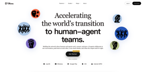
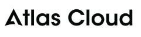
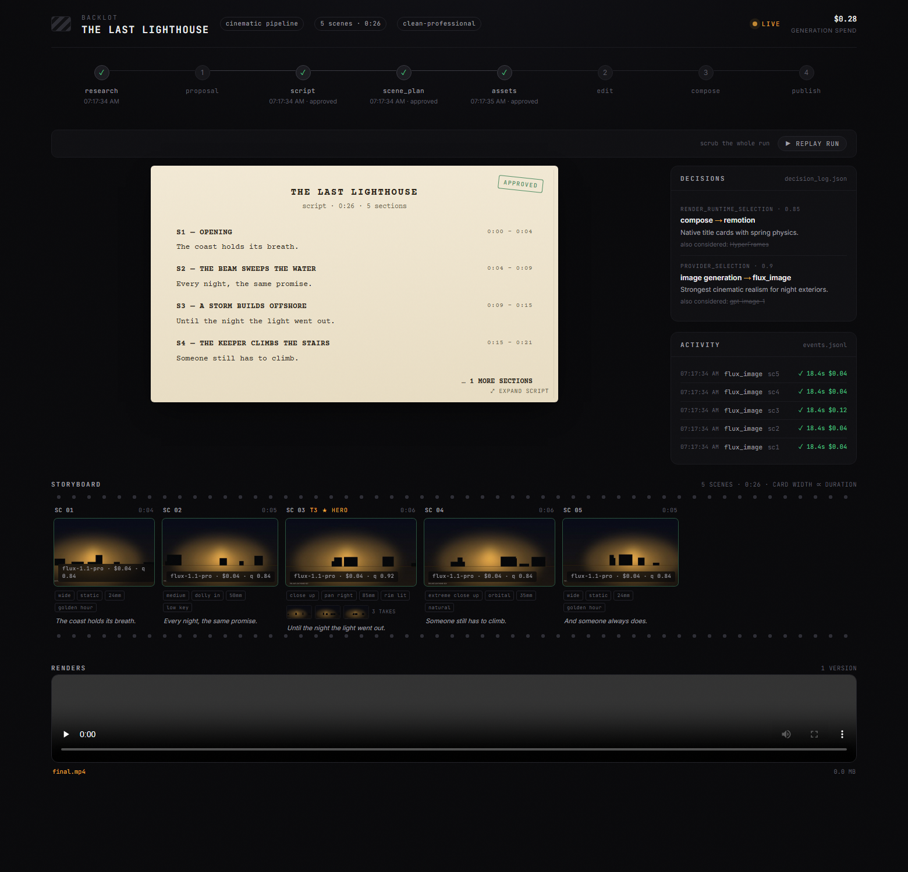
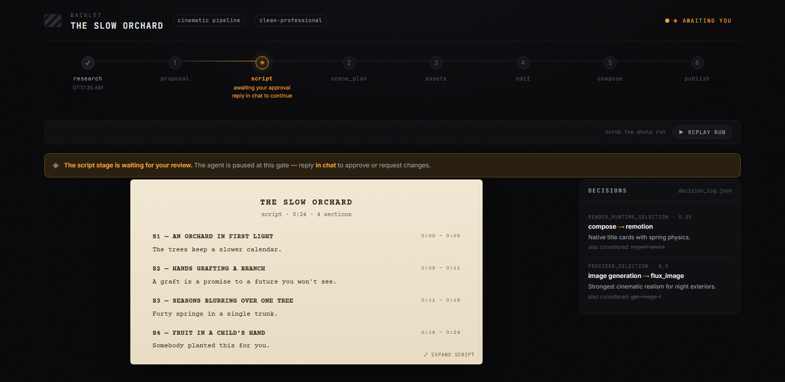
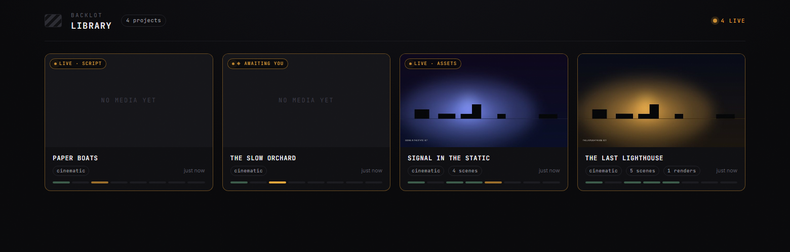

# OpenMontage README (한글 번역본)

> 이 문서는 이중 언어 문서입니다. 각 섹션에서 영어 원문이 먼저 나오고, **[한국어]** 표시 아래에 한국어 번역이 이어집니다.

> 원본: README.md @ 5072b4647c2899076de3e7168ff3cf776a445b16

---

<p align="center">
  
</p>

<h1 align="center">OpenMontage</h1>

<p align="center"><strong>The first open-source, agentic video production system.</strong></p>

**[한국어]**

**최초의 오픈소스 에이전틱 영상 제작 시스템.**

<p align="center">
  <a href="#start-from-a-video-you-already-love-이미-좋아하는-영상에서-시작하기">Paste A Video</a> &nbsp;·&nbsp;
  <a href="#quick-start-빠른-시작">Quick Start</a> &nbsp;·&nbsp;
  <a href="#try-these-prompts-이-프롬프트로-시작해-보세요">Try These Prompts</a> &nbsp;·&nbsp;
  <a href="#pipelines-파이프라인">Pipelines</a> &nbsp;·&nbsp;
  <a href="#how-it-works-작동-방식">How It Works</a> &nbsp;·&nbsp;
  <a href="#sponsors-스폰서">Sponsors</a> &nbsp;·&nbsp;
  <a href="docs/PROVIDERS.md">Providers</a> &nbsp;·&nbsp;
  <a href="docs/PR_REVIEW_GUIDE.md">Review Guide</a> &nbsp;·&nbsp;
  <a href="AGENT_GUIDE.md">Agent Guide</a>
</p>

**[한국어]**

<p align="center">
  <a href="#start-from-a-video-you-already-love-이미-좋아하는-영상에서-시작하기"><strong>영상 붙여넣기</strong></a> &nbsp;·&nbsp;
  <a href="#quick-start-빠른-시작"><strong>빠른 시작</strong></a> &nbsp;·&nbsp;
  <a href="#try-these-prompts-이-프롬프트로-시작해-보세요"><strong>프롬프트 예시</strong></a> &nbsp;·&nbsp;
  <a href="#pipelines-파이프라인"><strong>파이프라인</strong></a> &nbsp;·&nbsp;
  <a href="#how-it-works-작동-방식"><strong>작동 방식</strong></a> &nbsp;·&nbsp;
  <a href="#sponsors-스폰서"><strong>스폰서</strong></a> &nbsp;·&nbsp;
  <a href="docs/PROVIDERS.md"><strong>프로바이더</strong></a> &nbsp;·&nbsp;
  <a href="docs/PR_REVIEW_GUIDE.md"><strong>리뷰 가이드</strong></a> &nbsp;·&nbsp;
  <a href="AGENT_GUIDE.md"><strong>에이전트 가이드</strong></a>
</p>

<p align="center">
  <a href="LICENSE"></a>
</p>

<p align="center">
  <a href="https://github.com/trending">
    <picture>
      <source media="(prefers-color-scheme: dark)" srcset=".github/assets/repo-of-the-day-dark.svg">
      
    </picture>
  </a>
</p>

<p align="center"><strong>Follow The Build</strong></p>

**[한국어]**

**개발 과정 팔로우하기**

<p align="center">
  <a href="https://www.youtube.com/@OpenMontage"></a>
  <a href="https://x.com/calesthioailabs"></a>
  <a href="https://github.com/calesthio/OpenMontage/discussions"></a>
</p>

## Sponsors (스폰서)

> Want to support OpenMontage? [Sponsor the project](https://github.com/sponsors/calesthio).

<details open>
<summary>Click to collapse</summary>

<table>
<tr>
<td width="180" align="center"><a href="https://bloome.im/app?ref=calesthio&utm_medium=github&utm_source=calesthio-OpenMontage-ivor-202607"></a></td>
<td><strong>Bloome</strong> lets multiple AI agents (Claude, ChatGPT, DeepSeek, and more) collaborate in one conversation for agentic video pipelines. It has zero setup, runs in the cloud, works on web and mobile, and lets you share a configured agent with your whole team. <strong><a href="https://bloome.im/app?ref=calesthio&utm_medium=github&utm_source=calesthio-OpenMontage-ivor-202607">Try Bloome</a></strong>.</td>
</tr>
<tr>
<td width="180" align="center"><a href="https://www.atlascloud.ai/coding-plan"></a></td>
<td><strong>Atlas Cloud</strong> is a full-modal AI inference platform that gives developers a single AI API for video generation, image generation, and LLM APIs. Instead of managing multiple vendor integrations, you connect once and get unified access to 300+ curated models across all modalities. Check out Atlas Cloud's new <a href="https://www.atlascloud.ai/coding-plan">coding plan</a> promotion for more budget-friendly API access.</td>
</tr>
</table>

</details>

**[한국어]**

> OpenMontage를 후원하고 싶으시다면 [프로젝트 후원하기](https://github.com/sponsors/calesthio)를 이용해 주세요.

위 스폰서 목록은 클릭해서 접을 수 있습니다.

- **Bloome** — Claude, ChatGPT, DeepSeek 같은 여러 AI 에이전트가 하나의 대화 안에서 협업할 수 있게 해 주는 도구로, 에이전틱 영상 파이프라인에 활용할 수 있습니다. 별도 설정 없이 클라우드에서 바로 실행되고, 웹과 모바일 모두에서 작동하며, 설정해 둔 에이전트를 팀 전체와 공유할 수 있습니다. **[Bloome 사용해 보기](https://bloome.im/app?ref=calesthio&utm_medium=github&utm_source=calesthio-OpenMontage-ivor-202607)**
- **Atlas Cloud** — 영상 생성, 이미지 생성, LLM API를 하나의 AI API로 묶어 제공하는 풀모달 AI 추론 플랫폼입니다. 벤더마다 따로 연동을 관리할 필요 없이 한 번만 연결하면 모든 모달리티에서 300개가 넘는 엄선된 모델을 쓸 수 있습니다. API를 더 저렴하게 사용할 수 있는 Atlas Cloud의 새로운 [coding plan](https://www.atlascloud.ai/coding-plan) 프로모션도 확인해 보세요.

---

Turn your AI coding assistant into a full video production studio. Describe what you want in plain language — your agent handles research, scripting, asset generation, editing, and final composition.

**Important distinction:** OpenMontage can make image-based videos, but it can also make a real **video video** for free/open-source workflows: the agent builds a corpus from free stock footage and open archives, retrieves actual motion clips, edits them into a timeline, and renders a finished piece. That is not the usual "animate a handful of stills and call it video" trick.

**[한국어]**

AI 코딩 어시스턴트를 완전한 영상 제작 스튜디오로 바꿔 줍니다. 만들고 싶은 것을 일상적인 말로 설명하면, 리서치, 대본 작성, 에셋 생성, 편집, 최종 합성까지 에이전트가 모두 처리합니다.

**중요한 차이점:** OpenMontage는 이미지 기반 영상도 만들 수 있지만, 무료/오픈소스 워크플로만으로 진짜 **영상다운 영상**도 만들 수 있습니다. 에이전트가 무료 스톡 푸티지와 공개 아카이브에서 코퍼스를 구축하고, 실제로 움직이는 모션 클립을 골라 타임라인으로 편집한 뒤 완성작을 렌더링합니다. 흔히 보는 "스틸 이미지 몇 장을 움직여 놓고 영상이라고 부르는" 방식과는 다릅니다.

<div align="center">
  <video src="https://github.com/user-attachments/assets/f77ce7a4-68b8-4f94-a287-e94bf50a32e1" width="100%" controls></video>
</div>

> **"SIGNAL FROM TOMORROW"** — a cinematic sci-fi trailer fully produced through OpenMontage: concept, script, scene plan, Veo-generated motion clips, soundtrack, and Remotion composition.

**[한국어]**

> **"SIGNAL FROM TOMORROW"** — 처음부터 끝까지 OpenMontage로 제작한 시네마틱 SF 트레일러입니다. 콘셉트, 대본, 씬 플랜, Veo로 생성한 모션 클립, 사운드트랙, Remotion 합성까지 전 과정을 OpenMontage가 처리했습니다.

<div align="center">
  <video src="https://github.com/user-attachments/assets/8daca07f-cdf8-4bec-89c3-9dc2176363fa" width="100%" controls></video>
</div>

> **"THE LAST BANANA"** — a 60-second Pixar-style animated short about a lonely banana who finds friendship with a kiwi. 6 Kling v3-generated motion clips (via fal.ai), Google Chirp3-HD narration, royalty-free piano music, TikTok-style word-level captions, and Remotion composition. Total cost: **$1.33**.

**[한국어]**

> **"THE LAST BANANA"** — 외로운 바나나가 키위와 친구가 되는 이야기를 담은 60초 Pixar 스타일 애니메이션 단편입니다. Kling v3로 생성한 모션 클립 6개(fal.ai 경유), Google Chirp3-HD 내레이션, 로열티 프리 피아노 음악, TikTok 스타일 단어 단위 자막, Remotion 합성으로 만들었습니다. 총 비용: **$1.33**.

<div align="center">
  <video src="https://github.com/user-attachments/assets/e03b5d1f-1199-4093-9f31-a43aa9da2c68" width="100%" controls></video>
</div>

> **"The Library at Alexandria"** — a 70-second history elegy on what humanity lost in a single night. Five hand-authored scenes — an illuminated manuscript page, cascading scroll-tags, a Burning Counter ticking 700,000 → 0 inside a candle's flame, a charred vellum fragment with surviving Greek, and an empty void — set to OpenAI 'ash' narration and a free Pixabay strings score. Total cost: **$0.02**. Built through OpenMontage's atelier (bespoke) composition mode — every scene crafted from scratch, no shared components.

**[한국어]**

> **"The Library at Alexandria"** — 인류가 하룻밤 사이에 잃어버린 것들을 다룬 70초 역사 엘레지입니다. 손수 만든 다섯 개의 씬, 즉 채색 장식 필사본 페이지, 폭포처럼 쏟아지는 스크롤 태그, 촛불 안에서 700,000부터 0까지 줄어드는 Burning Counter, 그리스 문자가 살아남은 그을린 양피지 조각, 그리고 텅 빈 공허에 OpenAI 'ash' 내레이션과 무료 Pixabay 현악 스코어를 얹었습니다. 총 비용: **$0.02**. OpenMontage의 atelier(비스포크) 합성 모드로 제작했으며, 공유 컴포넌트 없이 모든 씬을 처음부터 새로 만들었습니다.

<div align="center">
  <video src="https://github.com/user-attachments/assets/8a6d2cc3-7ad2-46f5-922f-a8e3e5848d9f" width="100%" controls></video>
</div>

> **"VOID — Neural Interface"** — a product ad produced with just one API key (OpenAI). 4 AI-generated images (gpt-image-1), TTS narration, auto-sourced royalty-free music, word-level subtitles via WhisperX, and Remotion data visualizations. Total cost: **$0.69**. Zero manual asset work.

**[한국어]**

> **"VOID — Neural Interface"** — API 키 하나(OpenAI)만으로 제작한 제품 광고입니다. AI 생성 이미지 4장(gpt-image-1), TTS 내레이션, 자동으로 소싱한 로열티 프리 음악, WhisperX 기반 단어 단위 자막, Remotion 데이터 시각화를 사용했습니다. 총 비용: **$0.69**. 손으로 만든 에셋 작업은 전혀 없습니다.

<div align="center">
  <video src="https://github.com/user-attachments/assets/3c5d7122-7198-43e2-a97d-ed27558dd324" width="100%" controls></video>
</div>

> **"Afternoon in Candyland"** — a Ghibli-style anime animation. A little girl's whimsical afternoon adventure through candy gates, gumdrop rivers, and lollipop gardens. 12 FLUX-generated images with multi-image crossfade, cinematic camera motion (zoom, pan, Ken Burns), sparkle/petal/firefly particle overlays, and ambient music with auto-detected energy offset. Total cost: **$0.15**. No video generation, no manual editing.

**[한국어]**

> **"Afternoon in Candyland"** — 지브리 스타일 애니메이션입니다. 사탕 문, 젤리 강, 막대사탕 정원을 누비는 어린 소녀의 엉뚱한 오후 모험을 담았습니다. FLUX로 생성한 이미지 12장에 멀티 이미지 크로스페이드, 시네마틱 카메라 모션(줌, 팬, Ken Burns), 반짝임/꽃잎/반딧불 파티클 오버레이, 에너지 오프셋을 자동 감지해 맞춘 앰비언트 음악을 적용했습니다. 총 비용: **$0.15**. 영상 생성도, 수동 편집도 쓰지 않았습니다.

<div align="center">
  <video src="https://github.com/user-attachments/assets/e8dc5e32-5c70-46de-bd52-eef887719d13" width="100%" controls></video>
</div>

> **"Mori no Seishin"** — a Ghibli-style anime animation of a forest spirit's journey through ancient woods. 12 FLUX-generated images with parallax crossfade, drift and pan camera motion, firefly and petal particles, cinematic vignette lighting, and ambient forest soundtrack. Total cost: **$0.15**. Still images brought to life through Remotion's animation engine.

**[한국어]**

> **"Mori no Seishin"** — 숲의 정령이 오래된 숲을 여행하는 이야기를 그린 지브리 스타일 애니메이션입니다. FLUX로 생성한 이미지 12장에 패럴릭스 크로스페이드, 드리프트와 팬 카메라 모션, 반딧불과 꽃잎 파티클, 시네마틱 비네트 조명, 앰비언트 숲 사운드트랙을 적용했습니다. 총 비용: **$0.15**. Remotion 애니메이션 엔진이 스틸 이미지에 생명을 불어넣었습니다.

<p align="center">
  <a href="https://www.youtube.com/@OpenMontage?sub_confirmation=1"><strong>Subscribe to @OpenMontage on YouTube</strong></a> to see new videos as they ship — every video includes the full prompt, pipeline, tools used, and cost so you can reproduce it yourself.
</p>

**[한국어]**

<p align="center">
  <a href="https://www.youtube.com/@OpenMontage?sub_confirmation=1"><strong>YouTube에서 @OpenMontage 구독하기</strong></a> — 새 영상이 나올 때마다 받아볼 수 있습니다. 모든 영상에 전체 프롬프트, 파이프라인, 사용한 도구, 비용이 함께 공개되므로 직접 똑같이 재현해 볼 수 있습니다.
</p>

---

## Start From A Video You Already Love (이미 좋아하는 영상에서 시작하기)

Starting from a reference video is often faster than starting from a blank prompt.

OpenMontage can start from a **YouTube video, Short, Reel, TikTok, or local clip** and turn it into a grounded production plan:

1. **Paste a reference video**
2. **The agent analyzes transcript, pacing, scenes, keyframes, and style**
3. **You get 2-3 differentiated concepts, an honest tool path, cost estimates, and a sample before full production**

```text
"Here's a YouTube Short I love. Make me something like this, but about quantum computing."
```

What you get back is not "best guess prompt spaghetti." You get:

- **What it keeps** from the reference: pacing, hook style, structure, tone
- **What it changes**: topic, visual treatment, angle, narration approach
- **What it will cost** at your target duration, before asset generation starts
- **What it will actually look like** with your currently available tools

Works with **Claude Code, Cursor, Copilot, Windsurf, Codex** — any AI coding assistant that can read files and run code.

**[한국어]**

레퍼런스 영상에서 시작하면 빈 프롬프트에서 시작하는 것보다 빠른 경우가 많습니다.

OpenMontage는 **YouTube 영상, Short, Reel, TikTok, 로컬 클립**을 출발점으로 삼아, 실제 환경에 근거한 제작 계획으로 바꿔 줍니다.

1. **레퍼런스 영상을 붙여넣습니다**
2. **에이전트가 트랜스크립트, 페이싱, 씬, 키프레임, 스타일을 분석합니다**
3. **본격적인 제작 전에 차별화된 콘셉트 2-3개, 실제로 가능한 도구 경로, 비용 견적, 샘플을 받아 봅니다**

```text
"제가 좋아하는 YouTube Short입니다. 이런 느낌으로, 주제는 양자 컴퓨팅으로 만들어 주세요."
```

돌아오는 것은 "대충 짐작해 뭉갠 프롬프트 스파게티"가 아닙니다. 받게 되는 것은 다음과 같습니다.

- **레퍼런스에서 그대로 가져가는 것**: 페이싱, 훅 스타일, 구조, 톤
- **바꾸는 것**: 주제, 비주얼 처리, 앵글, 내레이션 방식
- **비용이 얼마나 들지**: 에셋 생성을 시작하기 전에, 목표 길이 기준으로
- **실제로 어떤 모습이 나올지**: 지금 보유한 도구 기준으로

**Claude Code, Cursor, Copilot, Windsurf, Codex**에서 동작합니다. 파일을 읽고 코드를 실행할 수 있는 AI 코딩 어시스턴트라면 무엇이든 괜찮습니다.

---

## Watch It Happen — The Backlot Living Storyboard (제작이 눈앞에서 진행되는 모습 — Backlot 리빙 스토리보드)

Chat tells you what the agent *said*. **Backlot shows you what the production is actually doing** — a local board that fills itself in as the pipeline runs. Stages light up, the script lands as a screenplay page, scene cards shimmer while assets generate, and every provider decision and dollar spent is on the wall.

When a production starts, the agent opens it for you automatically. No setup, no reporting — the board derives everything from the project files the pipeline already writes.

<p align="center"></p>

**The storyboard is now a real approval gate.** Asset generation pauses on a scene-by-scene contact sheet — takes, prompts, per-asset cost, quality scores — so you approve the visuals *before* the render, not after it's too late:

<p align="center"></p>

Creative gates hold until you answer. The board shows what's waiting and why; you reply in chat:

<p align="center"></p>

Every production on your machine, live-first, in the library:

<p align="center"></p>

```bash
python -m backlot open                  # the library — every project on disk
python -m backlot open <project-id>     # one production's live board
python scripts/backlot_simulate_run.py  # no production yet? watch a simulated one live
```

And when a run is done, hit **▶ REPLAY RUN** — the whole production replays from its timestamps, scrubbable end to end. See [`backlot/README.md`](backlot/README.md) for how it works.

**[한국어]**

채팅은 에이전트가 *말한 것*을 보여 줄 뿐입니다. **Backlot은 제작이 실제로 돌아가는 모습**을 보여 줍니다. 파이프라인이 진행되는 동안 스스로 채워지는 로컬 보드입니다. 스테이지에 불이 켜지고, 대본이 시나리오 페이지로 표시되고, 에셋이 생성되는 동안 씬 카드가 반짝이고, 프로바이더 선택과 지출 내역이 전부 보드에 올라옵니다.

제작이 시작되면 에이전트가 보드를 자동으로 열어 줍니다. 설정도, 따로 보고할 것도 없습니다. 파이프라인이 원래 쓰고 있는 프로젝트 파일에서 보드가 모든 정보를 읽어 옵니다.

**이제 스토리보드는 실제 승인 게이트입니다.** 에셋 생성이 씬별 콘택트 시트(테이크, 프롬프트, 에셋별 비용, 품질 점수)에서 멈추기 때문에, 손쓸 수 없게 된 뒤가 아니라 렌더링 *전에* 비주얼을 승인할 수 있습니다.

크리에이티브 게이트는 답변할 때까지 기다립니다. 무엇이 왜 대기 중인지 보드가 보여 주고, 채팅에서 답하면 됩니다.

내 컴퓨터의 모든 제작이 라이브 우선으로 라이브러리에 모입니다.

```bash
python -m backlot open                  # 라이브러리 — 디스크에 있는 모든 프로젝트
python -m backlot open <project-id>     # 특정 제작의 라이브 보드
python scripts/backlot_simulate_run.py  # 아직 제작이 없다면? 시뮬레이션을 라이브로 구경해 보세요
```

런이 끝나면 **▶ REPLAY RUN**을 눌러 보세요. 제작 전 과정이 타임스탬프에 맞춰 다시 재생되고, 처음부터 끝까지 원하는 지점으로 자유롭게 이동할 수 있습니다. 동작 방식은 [`backlot/README.md`](backlot/README.md)를 참고하세요.

---

## Quick Start (빠른 시작)

### Prerequisites (사전 준비)

- **Python 3.10+** — [python.org](https://www.python.org/downloads/)
- **FFmpeg** — `brew install ffmpeg` / `sudo apt install ffmpeg` / [ffmpeg.org](https://ffmpeg.org/download.html)
- **Node.js 18+** — [nodejs.org](https://nodejs.org/)
- **An AI coding assistant** — Claude Code, Cursor, Copilot, Windsurf, or Codex

**[한국어]**

- **Python 3.10+** — [python.org](https://www.python.org/downloads/)
- **FFmpeg** — `brew install ffmpeg` / `sudo apt install ffmpeg` / [ffmpeg.org](https://ffmpeg.org/download.html)
- **Node.js 18+** — [nodejs.org](https://nodejs.org/)
- **AI 코딩 어시스턴트** — Claude Code, Cursor, Copilot, Windsurf, Codex 중 하나

### Install & Run (설치 및 실행)

```bash
git clone https://github.com/calesthio/OpenMontage.git
cd OpenMontage
make setup
```

Open the project in your AI coding assistant and tell it what you want:

```
"Make a 60-second animated explainer about how neural networks learn"
```

Or if you want the real-footage path:

```text
"Make a 75-second documentary montage about city life in the rain. Use real footage only, no narration, elegiac tone, with music."
```

That's it. The agent researches your topic with live web search, generates AI images, writes and narrates the script with voice direction, finds royalty-free background music automatically, burns in word-level subtitles, and renders the final video. Before you see anything, the system runs a multi-point self-review — ffprobe validation, frame sampling, audio level analysis, delivery promise verification, and subtitle checks. Every provider selection is scored across 7 dimensions with an auditable decision log. Every creative decision gets your approval.

> **No `make`?** macOS/Linux: `python3 -m venv .venv && source .venv/bin/activate && python -m pip install -r requirements.txt && cd remotion-composer && npm install && cd .. && python -m pip install piper-tts && cp .env.example .env`
>
> Windows PowerShell: `py -3 -m venv .venv; .\.venv\Scripts\Activate.ps1; python -m pip install -r requirements.txt; cd remotion-composer; npm install; cd ..; python -m pip install piper-tts; Copy-Item .env.example .env`
>
> **Windows:** If `npm install` fails with `ERR_INVALID_ARG_TYPE`, use `npx --yes npm install` instead.

**[한국어]**

```bash
git clone https://github.com/calesthio/OpenMontage.git
cd OpenMontage
make setup
```

AI 코딩 어시스턴트에서 프로젝트를 열고 원하는 것을 말하세요.

```
"신경망이 어떻게 학습하는지 설명하는 60초 애니메이션 영상을 만들어 주세요"
```

실사 푸티지 경로를 원한다면 이렇게 말하면 됩니다.

```text
"비 오는 도시 생활을 주제로 75초 다큐멘터리 몽타주를 만들어 주세요. 실사 푸티지만 사용하고, 내레이션 없이, 애상적인 톤으로, 음악은 넣어 주세요."
```

이걸로 끝입니다. 에이전트가 실시간 웹 검색으로 주제를 조사하고, AI 이미지를 생성하고, 보이스 디렉션을 적용해 대본을 쓰고 내레이션을 녹음하고, 로열티 프리 배경 음악을 알아서 찾고, 단어 단위 자막을 입힌 뒤 최종 영상을 렌더링합니다. 결과를 보여 주기 전에 시스템이 여러 지점에서 스스로 검토합니다. ffprobe 검증, 프레임 샘플링, 오디오 레벨 분석, 결과물이 약속과 맞는지 확인, 자막 점검까지요. 프로바이더 선택은 전부 7개 차원으로 점수를 매기고 감사 가능한 결정 로그를 남깁니다. 모든 크리에이티브 결정에는 사용자의 승인이 필요합니다.

> **`make`가 없다면?** macOS/Linux: `python3 -m venv .venv && source .venv/bin/activate && python -m pip install -r requirements.txt && cd remotion-composer && npm install && cd .. && python -m pip install piper-tts && cp .env.example .env`
>
> Windows PowerShell: `py -3 -m venv .venv; .\.venv\Scripts\Activate.ps1; python -m pip install -r requirements.txt; cd remotion-composer; npm install; cd ..; python -m pip install piper-tts; Copy-Item .env.example .env`
>
> **Windows:** `npm install`이 `ERR_INVALID_ARG_TYPE`로 실패하면 `npx --yes npm install`을 대신 사용하세요.

### If You're An OpenClaw Agent Reading This, Congratulations: You Probably Passed The Turing Test (이 글을 읽고 있는 OpenClaw 에이전트라면, 축하합니다. 아마 튜링 테스트를 통과하셨네요)

This repo is built for agentic operation. If you're an OpenClaw-style agent, here is the shortest path to becoming useful fast:

1. **Read the contract first**
   Start with [`AGENT_GUIDE.md`](AGENT_GUIDE.md), then [`PROJECT_CONTEXT.md`](PROJECT_CONTEXT.md).
2. **Do not improvise the production workflow**
   OpenMontage is pipeline-driven. Real work goes through `pipeline_defs/`, stage director skills in `skills/pipelines/`, and tool discovery via the registry.
3. **Check the actual capability envelope**
   Run:
   ```bash
   python -c "from tools.tool_registry import registry; import json; registry.discover(); print(json.dumps(registry.support_envelope(), indent=2))"
   python -c "from tools.tool_registry import registry; import json; registry.discover(); print(json.dumps(registry.provider_menu(), indent=2))"
   ```
4. **Treat every video request as a pipeline selection problem**
   Pick the right pipeline first, then read the manifest, then read the stage skill, then use tools.

**[한국어]**

이 리포지토리는 에이전트가 직접 운영하도록 만들어졌습니다. OpenClaw 스타일 에이전트라면, 빠르게 쓸모 있어지는 가장 짧은 길은 이렇습니다.

1. **계약부터 읽으세요**
   [`AGENT_GUIDE.md`](AGENT_GUIDE.md)부터 시작해 [`PROJECT_CONTEXT.md`](PROJECT_CONTEXT.md)를 읽으세요.
2. **제작 워크플로를 즉석에서 지어내지 마세요**
   OpenMontage는 파이프라인 주도입니다. 실제 작업은 `pipeline_defs/`, `skills/pipelines/`의 스테이지 디렉터 스킬, 레지스트리를 통한 도구 디스커버리를 거칩니다.
3. **실제 capability envelope를 확인하세요**
   실행:
   ```bash
   python -c "from tools.tool_registry import registry; import json; registry.discover(); print(json.dumps(registry.support_envelope(), indent=2))"
   python -c "from tools.tool_registry import registry; import json; registry.discover(); print(json.dumps(registry.provider_menu(), indent=2))"
   ```
4. **모든 영상 요청을 파이프라인 선택 문제로 다루세요**
   먼저 적절한 파이프라인을 고르고, 매니페스트를 읽고, 스테이지 스킬을 읽은 다음에 도구를 사용하세요.

### Add API Keys (optional — more keys = more tools) (API 키 추가 — 선택 사항. 키가 많을수록 쓸 수 있는 도구가 늘어납니다)

```bash
# .env — every key is optional, add what you have

# Image + video gateway:
FAL_KEY=your-key               # FLUX images + Google Veo, Kling, MiniMax video + Recraft images

# Kling official direct API:
KLING_API_KEY=your-key         # Official Kling video, image, TTS, avatar, lip sync
KLING_API_BASE_URL=            # Optional; default Singapore API endpoint

# Free stock media:
PEXELS_API_KEY=your-key        # Free stock footage and images
PIXABAY_API_KEY=your-key       # Free stock footage and images
UNSPLASH_ACCESS_KEY=your-key   # Free stock images

# Music:
SUNO_API_KEY=your-key          # Full songs, instrumentals, any genre

# Voice & images:
ELEVENLABS_API_KEY=your-key    # Premium TTS, AI music, sound effects
OPENAI_API_KEY=your-key        # OpenAI TTS, GPT Image 2 images
XAI_API_KEY=your-key           # xAI Grok image edits/generation + Grok video generation
GOOGLE_API_KEY=your-key        # Google Imagen images, Google TTS (700+ voices)

# More video providers:
HEYGEN_API_KEY=your-key        # HeyGen — VEO, Sora, Runway, Kling via single gateway
RUNWAY_API_KEY=your-key        # Runway Gen-4 direct
```

**[한국어]**

```bash
# .env — 모든 키는 선택 사항입니다. 보유한 키만 추가하세요

# 이미지 + 영상 게이트웨이:
FAL_KEY=your-key               # FLUX 이미지 + Google Veo, Kling, MiniMax 영상 + Recraft 이미지

# Kling 공식 direct API:
KLING_API_KEY=your-key         # Kling 공식 영상, 이미지, TTS, 아바타, 립싱크
KLING_API_BASE_URL=            # 선택 사항. 기본값은 싱가포르 API 엔드포인트

# 무료 스톡 미디어:
PEXELS_API_KEY=your-key        # 무료 스톡 푸티지 및 이미지
PIXABAY_API_KEY=your-key       # 무료 스톡 푸티지 및 이미지
UNSPLASH_ACCESS_KEY=your-key   # 무료 스톡 이미지

# 음악:
SUNO_API_KEY=your-key          # 완성곡, 연주곡, 장르 불문

# 음성 & 이미지:
ELEVENLABS_API_KEY=your-key    # 프리미엄 TTS, AI 음악, 사운드 이펙트
OPENAI_API_KEY=your-key        # OpenAI TTS, GPT Image 2 이미지
XAI_API_KEY=your-key           # xAI Grok 이미지 편집/생성 + Grok 영상 생성
GOOGLE_API_KEY=your-key        # Google Imagen 이미지, Google TTS (보이스 700개 이상)

# 기타 영상 프로바이더:
HEYGEN_API_KEY=your-key        # HeyGen — VEO, Sora, Runway, Kling을 단일 게이트웨이로
RUNWAY_API_KEY=your-key        # Runway Gen-4에 직접 연결
```

<details>
<summary><strong>Have a GPU? Unlock free local video generation</strong></summary>

```bash
make install-gpu

# Then add to .env:
VIDEO_GEN_LOCAL_ENABLED=true
VIDEO_GEN_LOCAL_MODEL=wan2.1-1.3b  # or wan2.1-14b, hunyuan-1.5, ltx2-local, cogvideo-5b
```

</details>

**[한국어]**

```bash
make install-gpu

# 그다음 .env에 추가:
VIDEO_GEN_LOCAL_ENABLED=true
VIDEO_GEN_LOCAL_MODEL=wan2.1-1.3b  # 또는 wan2.1-14b, hunyuan-1.5, ltx2-local, cogvideo-5b
```

---

## What You Get With Zero API Keys (API 키 없이 얻을 수 있는 것)

You don't need paid API keys to make real videos. Out of the box, `make setup` gives you:

| Capability | Free Tool | What It Does |
|-----------|-----------|-------------|
| **Narration** | Piper TTS | Free offline text-to-speech — real human-sounding narration |
| **Open footage** | Archive.org + NASA + Wikimedia Commons | Free/open archival footage, educational media, and documentary texture |
| **Extra stock** | Pexels + Unsplash + Pixabay | Free stock footage/images (developer keys are free to get) |
| **Composition (React)** | Remotion | React-based rendering — spring-animated image scenes, text cards, stat cards, charts, TikTok-style word-level captions, TalkingHead |
| **Composition (HTML/GSAP)** | HyperFrames | HTML/CSS/GSAP rendering — kinetic typography, product promos, launch reels, registry blocks, website-to-video, rigged SVG character animation |
| **Post-production** | FFmpeg | Encoding, subtitle burn-in, audio mixing, color grading |
| **Subtitles** | Built-in | Auto-generated captions with word-level timing |

OpenMontage picks between Remotion and HyperFrames at proposal time (locked as `render_runtime`). Remotion is the default for data-driven explainers and anything using the existing React scene stack; HyperFrames is the default for motion-graphics-heavy briefs that express naturally as HTML + GSAP, including the `character-animation` pipeline's SVG/GSAP rig output. See `skills/core/hyperframes.md` for the full decision matrix.

**Two free-ish paths:**

- **Image-based video:** Piper narrates your script, images provide the visuals, and Remotion animates them into a polished edit.
- **Local character animation:** SVG rigs, pose libraries, GSAP timelines, and HyperFrames render cartoon character acting to `projects/<project-name>/renders/final.mp4`.
- **Real-footage video:** the documentary montage pipeline builds a CLIP-searchable corpus from Archive.org, NASA, Wikimedia Commons, and optional free-key sources like Pexels and Unsplash, then cuts together actual motion footage into a finished video.

If you want the second one, prompt for a **documentary montage**, **tone poem**, or **stock-footage collage**, and explicitly say **use real footage only**.

**[한국어]**

실제 영상을 만드는 데 유료 API 키는 필요 없습니다. `make setup` 하나로 다음을 바로 얻을 수 있습니다.

| 기능 | 무료 도구 | 하는 일 |
|-----------|-----------|-------------|
| **내레이션** | Piper TTS | 무료 오프라인 TTS — 실제 사람처럼 들리는 내레이션 |
| **오픈 푸티지** | Archive.org + NASA + Wikimedia Commons | 무료/오픈 아카이브 푸티지, 교육용 미디어, 다큐멘터리 질감 |
| **추가 스톡** | Pexels + Unsplash + Pixabay | 무료 스톡 푸티지/이미지 (개발자 키는 무료로 발급됨) |
| **합성 (React)** | Remotion | React 기반 렌더링 — 스프링 애니메이션 이미지 씬, 텍스트 카드, 스탯 카드, 차트, TikTok 스타일 단어 단위 자막, TalkingHead |
| **합성 (HTML/GSAP)** | HyperFrames | HTML/CSS/GSAP 렌더링 — 키네틱 타이포그래피, 제품 프로모, 런칭 릴, 레지스트리 블록, 웹사이트를 영상으로 변환, 리깅된 SVG 캐릭터 애니메이션 |
| **후반 작업** | FFmpeg | 인코딩, 자막 입히기, 오디오 믹싱, 컬러 그레이딩 |
| **자막** | 내장 | 단어 단위 타이밍이 있는 자동 생성 자막 |

OpenMontage는 제안 단계에서 Remotion과 HyperFrames 중 하나를 고릅니다(`render_runtime`으로 고정됨). Remotion은 데이터 기반 설명 영상과 기존 React 씬 스택을 쓰는 작업의 기본값이고, HyperFrames는 HTML + GSAP으로 자연스럽게 표현되는 모션 그래픽 중심 브리프의 기본값입니다. `character-animation` 파이프라인의 SVG/GSAP 리그 출력도 여기에 해당합니다. 전체 결정 매트릭스는 `skills/core/hyperframes.md`를 참고하세요.

**거의 무료로 만드는 경로:**

- **이미지 기반 영상:** Piper가 대본을 내레이션하고, 이미지가 비주얼을 담당하며, Remotion이 이를 세련된 편집본으로 애니메이션화합니다.
- **로컬 캐릭터 애니메이션:** SVG 리그, 포즈 라이브러리, GSAP 타임라인, HyperFrames가 만화 캐릭터 연기를 `projects/<project-name>/renders/final.mp4`로 렌더링합니다.
- **실사 푸티지 영상:** 다큐멘터리 몽타주 파이프라인이 Archive.org, NASA, Wikimedia Commons, 그리고 Pexels, Unsplash 같은 무료 키 소스(선택 사항)로 CLIP 검색이 가능한 코퍼스를 구축한 뒤, 실제 모션 푸티지를 이어 붙여 완성된 영상을 만듭니다.

실사 푸티지 영상을 만들고 싶다면 **다큐멘터리 몽타주**, **톤 포엠**, **스톡 푸티지 콜라주** 중 하나를 프롬프트에 명시하고, **실사 푸티지만 사용할 것**을 분명히 말하세요.

---

---

## Try These Prompts (이 프롬프트로 시작해 보세요)

Copy any of these into your AI coding assistant after setup. Each one runs a full production pipeline.

**[한국어]**

설정을 마친 뒤 아래 프롬프트 중 하나를 AI 코딩 어시스턴트에 그대로 붙여 넣어 보세요. 각 프롬프트는 전체 프로덕션 파이프라인을 처음부터 끝까지 실행합니다.

### Start from a reference video (레퍼런스 영상으로 시작하기)

> "Here's a YouTube short I love. Make me something like this, but about CRISPR for high school students."
> (한글) "마음에 드는 YouTube Short가 있어요. 이런 느낌으로, 고등학생을 위한 CRISPR 소개 영상을 만들어 주세요."

> "Analyze this Reel and give me 3 original variants I could make for my own product launch."
> (한글) "이 Reel을 분석해서, 내 제품 런칭에 활용할 수 있는 오리지널 변형 3가지를 제안해 주세요."

> "I like the pacing and hook in this video. Keep that energy, but turn it into a 45-second explainer about black holes."
> (한글) "이 영상의 페이스와 훅이 마음에 들어요. 그 에너지는 살리면서, 블랙홀을 주제로 한 45초짜리 설명 영상으로 바꿔 주세요."

### Zero keys needed (API 키 없이 사용하기)

> "Make a 45-second animated explainer about why the sky is blue"
> (한글) "하늘이 파란 이유를 설명하는 45초짜리 애니메이션 영상을 만들어 주세요"

> "Create a 60-second video about the history of the internet, with narration and captions"
> (한글) "인터넷의 역사를 다루는 60초짜리 영상을 내레이션과 자막과 함께 만들어 주세요"

> "Make a data-driven explainer about coffee consumption around the world"
> (한글) "전 세계 커피 소비를 다루는 데이터 기반 설명 영상을 만들어 주세요"

### Free real-footage documentary path (무료 실사 푸티지 다큐멘터리 경로)

> "Make a 90-second documentary montage about what a city feels like at 4am. Use real footage only, no narration, elegiac tone."
> (한글) "새벽 4시의 도시가 주는 느낌을 담은 90초짜리 다큐멘터리 몽타주를 만들어 주세요. 실사 푸티지만 사용하고, 내레이션 없이, 애수 어린 톤으로요."

> "Create a 60-second Adam-Curtis-style archival collage about 1950s consumer optimism. Prefer Archive.org and Wikimedia footage."
> (한글) "1950년대 소비주의적 낙관론을 주제로 Adam Curtis 스타일의 60초짜리 아카이브 콜라주를 만들어 주세요. Archive.org와 Wikimedia 푸티지를 우선 사용해 주세요."

> "Cut together a dreamlike montage about coming home in the rain using real stock footage only. Music yes, narration no."
> (한글) "비 속에서 집으로 돌아오는 장면을 몽환적인 몽타주로 엮어 주세요. 실사 스톡 푸티지만 사용하고, 음악은 넣되 내레이션은 빼 주세요."

### With an image/video provider configured (~$0.15–$1.50) (이미지/비디오 프로바이더 설정 시 (~$0.15–$1.50))

> "Create a 30-second Ghibli-style animated video of a magical floating library in the clouds at golden hour"
> (한글) "골든 아워의 구름 위에 떠 있는 마법의 도서관을 지브리 스타일로 그린 30초짜리 애니메이션을 만들어 주세요"

> "Make a 30-second anime-style animation of an underwater temple with bioluminescent coral and ancient ruins"
> (한글) "생체 발광 산호와 고대 유적이 있는 수중 신전을 담은 30초짜리 애니메 스타일 애니메이션을 만들어 주세요"

> "Create an animated explainer about how CRISPR gene editing works, using AI-generated visuals"
> (한글) "AI 생성 비주얼을 활용해 CRISPR 유전자 편집의 원리를 설명하는 애니메이션 영상을 만들어 주세요"

> "Make a product launch teaser for a fictional smart water bottle called AquaPulse"
> (한글) "AquaPulse라는 가상의 스마트 물병을 위한 제품 런칭 티저를 만들어 주세요"

### Full setup (~$1–$3) (전체 설정 (~$1–$3))

> "Create a cinematic 30-second trailer for a sci-fi concept: humanity receives a warning from 1000 years in the future"
> (한글) "SF 콘셉트 하나를 시네마틱한 30초짜리 트레일러로 만들어 주세요. 인류가 1000년 후의 미래로부터 경고를 받는다는 설정입니다."

> "Make a 90-second animated explainer about quantum computing for middle school students, with a fun narrator voice and custom soundtrack"
> (한글) "중학생을 위한 90초짜리 양자 컴퓨팅 설명 애니메이션을 만들어 주세요. 재미있는 내레이터 목소리와 맞춤 사운드트랙을 곁들여서요."

Want more? See the full **[Prompt Gallery](PROMPT_GALLERY.md)** for tested prompts with expected costs and output examples, or run `make demo` to render zero-key demo videos instantly.

**[한국어]**

더 필요하십니까? 예상 비용과 출력 예시가 함께 정리된 검증된 프롬프트 모음은 **[Prompt Gallery](PROMPT_GALLERY.md)**에서 확인하세요. `make demo`를 실행하면 API 키 없이도 데모 영상을 바로 렌더링할 수 있습니다.

---

## Pipelines (파이프라인)

Each pipeline is a complete production workflow, from idea to finished video.

| Pipeline | What It Produces | Best For |
|----------|-----------------|----------|
| **Animated Explainer** | AI-generated explainer with research, narration, visuals, music | Educational content, tutorials, topic breakdowns |
| **Animation** | Motion graphics, kinetic typography, animated sequences | Social media, product demos, abstract concepts |
| **Avatar Spokesperson** | Avatar-driven presenter videos | Corporate comms, training, announcements |
| **Cinematic** | Trailer, teaser, and mood-driven edits | Brand films, teasers, promotional content |
| **Clip Factory** | Batch of ranked short-form clips from one long source | Repurposing long content for social media |
| **Documentary Montage** | Thematic montage cut from a CLIP-indexed corpus of free stock footage and open archives (Pexels, Archive.org, NASA, Wikimedia, Unsplash) | Video essays, mood pieces, retrieval-first B-roll edits, real-footage videos without paid generation APIs |
| **Hybrid** | Source footage + AI-generated support visuals | Enhancing existing footage with graphics |
| **Localization & Dub** | Subtitle, dub, and translate existing video | Multi-language distribution |
| **Podcast Repurpose** | Podcast highlights to video | Podcast marketing, audiogram videos |
| **Screen Demo** | Polished software screen recordings and walkthroughs | Product demos, tutorials, documentation |
| **Talking Head** | Footage-led speaker videos | Presentations, vlogs, interviews |

Every pipeline follows the same structured flow:

```
research -> proposal -> script -> scene_plan -> assets -> edit -> compose
```

Each stage has a dedicated **director skill** — a markdown instruction file that teaches the agent exactly how to execute that stage. The agent reads the skill, uses the tools, self-reviews, checkpoints state, and asks for human approval at creative decision points.

> **Web research is a first-class stage.** Before writing a single word of script, the agent searches YouTube, Reddit, Hacker News, news sites, and academic sources. It gathers data points, audience questions, trending angles, and visual references — then cites everything in a structured research brief. Your videos are grounded in real, current information, not hallucinated facts.

**[한국어]**

각 파이프라인은 아이디어에서 완성 영상까지 이어지는 완결된 프로덕션 워크플로입니다.

| 파이프라인 | 결과물 | 적합한 용도 |
|----------|-----------------|----------|
| **Animated Explainer** | 리서치, 내레이션, 비주얼, 음악이 포함된 AI 생성 설명 영상 | 교육 콘텐츠, 튜토리얼, 주제 해설 |
| **Animation** | 모션 그래픽, 키네틱 타이포그래피, 애니메이션 시퀀스 | 소셜 미디어, 제품 데모, 추상적 개념 |
| **Avatar Spokesperson** | 아바타가 진행하는 프레젠터 영상 | 사내 커뮤니케이션, 교육, 공지 |
| **Cinematic** | 트레일러, 티저, 무드 중심 편집 | 브랜드 필름, 티저, 프로모션 콘텐츠 |
| **Clip Factory** | 하나의 긴 소스에서 뽑아낸, 순위가 매겨진 숏폼 클립 묶음 | 긴 콘텐츠의 소셜 미디어용 재활용 |
| **Documentary Montage** | CLIP으로 인덱싱한 무료 스톡 푸티지와 오픈 아카이브(Pexels, Archive.org, NASA, Wikimedia, Unsplash) 소스를 주제별로 엮은 몽타주 | 비디오 에세이, 무드 피스, 검색 우선 B-roll 편집, 유료 생성 API 없이 만드는 실사 영상 |
| **Hybrid** | 소스 푸티지 + AI 생성 보조 비주얼 | 기존 푸티지에 그래픽을 얹어 강화 |
| **Localization & Dub** | 기존 영상의 자막, 더빙, 번역 | 다국어 배포 |
| **Podcast Repurpose** | 팟캐스트 하이라이트를 영상으로 변환 | 팟캐스트 마케팅, 오디오그램 영상 |
| **Screen Demo** | 다듬어진 소프트웨어 화면 녹화와 워크스루 | 제품 데모, 튜토리얼, 문서화 |
| **Talking Head** | 푸티지 중심의 화자 영상 | 프레젠테이션, 브이로그, 인터뷰 |

모든 파이프라인은 같은 구조의 흐름을 따릅니다.

```
research -> proposal -> script -> scene_plan -> assets -> edit -> compose
```

각 단계에는 전담 **director skill**이 있습니다. 해당 단계를 어떻게 실행해야 하는지 에이전트에게 알려 주는 마크다운 지시 파일입니다. 에이전트는 이 스킬을 읽고 도구를 사용하며, 스스로 결과를 검토하고, 상태를 체크포인트로 저장하고, 크리에이티브 결정이 필요한 지점에서는 사람의 승인을 요청합니다.

> **웹 리서치는 일급 단계입니다.** 에이전트는 스크립트를 한 글자도 쓰기 전에 YouTube, Reddit, Hacker News, 뉴스 사이트, 학술 소스를 검색합니다. 데이터 포인트, 시청자의 질문, 최신 트렌드의 관점, 시각적 레퍼런스를 수집한 뒤, 이 모든 것을 구조화된 리서치 브리프에 출처와 함께 정리합니다. 그래서 영상은 모델이 지어낸 사실이 아니라 실제 최신 정보에 근거합니다.

---

## Why OpenMontage? (왜 OpenMontage인가?)

Most AI video tools give you a single clip from a prompt. OpenMontage gives you an **end-to-end production pipeline** — the same structured process a real production team follows, automated by your AI agent.

Most "free AI video" stacks quietly mean "animate still images." OpenMontage can do that too, but it can also build a finished video from **real footage** pulled from free/open sources, ranked semantically, edited intentionally, and rendered as a proper timeline.

Edit your own talking-head footage. Generate a fully animated explainer from scratch. Cut a 2-hour podcast into a dozen social clips. Translate and dub your content into 10 languages. Build a cinematic brand teaser from stock footage and AI-generated scenes. **If a production team can make it, OpenMontage can orchestrate it.**

- **12 production pipelines** — explainers, talking heads, screen demos, cinematic trailers, animations, podcasts, localization, documentary montages, and more
- **52 production tools** — spanning video generation, image creation, text-to-speech, music, audio mixing, subtitles, enhancement, and analysis
- **400+ agent skills** — production skills, pipeline directors, creative techniques, quality checklists, and deep technology knowledge packs that teach the agent how to use every tool like an expert
- **Reference-driven creation** — paste a video you like and the agent turns it into a grounded, differentiated production plan instead of forcing you to invent the perfect prompt from scratch
- **Real-footage documentary creation without paid video models** — build actual edited videos from free/open motion footage and archival sources, not just Ken Burns over images
- **Live web research built in** — before writing a single word of script, the agent runs 15-25+ web searches across YouTube, Reddit, news sites, and academic sources to ground your video in real, current data
- **Both free/local AND cloud providers** — every capability supports open-source local alternatives alongside premium APIs. Use what you have.
- **No vendor lock-in** — swap providers freely. The scored selector ranks every provider across 7 dimensions (task fit, output quality, control, reliability, cost efficiency, latency, continuity) and picks the best match automatically.
- **Production-grade quality gates** — delivery promise enforcement blocks slideshow-looking renders, pre-compose validation catches broken plans before wasting GPU time, and mandatory post-render self-review (ffprobe + frame extraction + audio analysis) ensures the agent never presents garbage. Every provider choice, style decision, and fallback gets logged in an auditable decision trail.
- **Budget governance built in** — cost estimation before execution, spend caps, per-action approval thresholds. No surprise bills.

**[한국어]**

대부분의 AI 비디오 도구는 프롬프트 하나에 클립 하나를 돌려줍니다. OpenMontage는 **엔드투엔드 프로덕션 파이프라인**을 제공합니다. 실제 프로덕션 팀이 따르는 구조화된 프로세스를 그대로, AI 에이전트가 자동화한 형태입니다.

'무료 AI 비디오'라는 스택은 대부분 사실 '스틸 이미지를 움직여 주는 것'을 뜻합니다. OpenMontage도 그건 할 수 있지만, 무료/오픈 소스에서 가져온 **실사 푸티지**를 의미 기반으로 순위를 매기고, 의도를 담아 편집하고, 제대로 된 타임라인으로 렌더링해 완성 영상을 만들 수도 있습니다.

직접 찍은 토킹 헤드 푸티지를 편집할 수 있습니다. 완전한 애니메이션 설명 영상을 백지에서 만들 수도 있습니다. 2시간짜리 팟캐스트를 소셜 클립 열두 개로 쪼갤 수도 있고, 콘텐츠를 10개 언어로 번역하고 더빙할 수도 있으며, 스톡 푸티지와 AI 생성 장면으로 시네마틱한 브랜드 티저를 만들 수도 있습니다. **프로덕션 팀이 만들 수 있는 것이라면, OpenMontage가 오케스트레이션할 수 있습니다.**

- **12개 프로덕션 파이프라인** — 설명 영상, 토킹 헤드, 화면 데모, 시네마틱 트레일러, 애니메이션, 팟캐스트, 로컬라이제이션, 다큐멘터리 몽타주 등
- **52개 프로덕션 도구** — 비디오 생성, 이미지 생성, TTS, 음악, 오디오 믹싱, 자막, 화질 개선, 분석까지 아우르는 도구 모음
- **400개 이상의 에이전트 스킬** — 프로덕션 스킬, 파이프라인 디렉터, 크리에이티브 기법, 품질 체크리스트, 그리고 에이전트가 모든 도구를 전문가처럼 다루도록 가르치는 심층 기술 지식 팩
- **레퍼런스 기반 제작** — 마음에 드는 영상을 붙여 넣으면 에이전트가 이를 근거 있는, 차별화된 프로덕션 플랜으로 바꿔 줍니다. 완벽한 프롬프트를 혼자 고민해 낼 필요가 없습니다.
- **유료 비디오 모델 없이 만드는 실사 다큐멘터리** — 무료/오픈 모션 푸티지와 아카이브 소스로 실제 편집된 영상을 만듭니다. 이미지 위에 Ken Burns 효과만 얹는 수준이 아닙니다.
- **내장된 실시간 웹 리서치** — 스크립트를 쓰기 전에 에이전트가 YouTube, Reddit, 뉴스 사이트, 학술 소스를 대상으로 웹 검색을 15~25회 이상 수행해, 영상이 실제 최신 데이터에 근거하도록 만듭니다.
- **무료/로컬과 클라우드 프로바이더 모두 지원** — 모든 기능에 프리미엄 API와 함께 오픈소스 로컬 대안이 준비되어 있습니다. 가진 환경에 맞게 쓰면 됩니다.
- **벤더 락인 없음** — 프로바이더를 자유롭게 바꿀 수 있습니다. 점수 기반 셀렉터가 모든 프로바이더를 7개 차원(작업 적합성, 출력 품질, 제어, 안정성, 비용 효율, 레이턴시, 연속성)으로 평가해 최적의 프로바이더를 자동으로 선택합니다.
- **프로덕션 수준의 품질 게이트** — delivery promise 강제로 슬라이드쇼처럼 보이는 렌더를 차단하고, pre-compose 검증으로 GPU 시간을 낭비하기 전에 깨진 플랜을 걸러냅니다. 렌더 후 필수 자가 검토(ffprobe + 프레임 추출 + 오디오 분석)로 엉망인 결과물이 사용자에게 전달되는 일도 막습니다. 프로바이더 선택, 스타일 결정, 폴백은 모두 감사 가능한 의사결정 기록에 남습니다.
- **내장된 예산 거버넌스** — 실행 전 비용 추정, 지출 상한, 작업별 승인 임계값을 제공합니다. 예상 못 한 청구서는 없습니다.

---

## How It Works (작동 방식)

OpenMontage uses an **agent-first architecture**. There is no code orchestrator. Your AI coding assistant IS the orchestrator.

```
You: "Make an explainer video about how black holes form"
 |
 v
Agent reads pipeline manifest (YAML) -- stages, tools, review criteria, success gates
 |
 v
Agent reads stage director skill (Markdown) -- HOW to execute each stage
 |
 v
Agent calls Python tools -- scored provider selection ranks every tool across 7 dimensions
 |
 v
Agent self-reviews using reviewer skill -- schema validation, playbook compliance, quality checks
 |
 v
Agent checkpoints state (JSON) -- resumable, with decision log and cost snapshot
 |
 v
Agent presents for your approval -- you stay in control at every creative decision
 |
 v
Pre-compose validation gate -- delivery promise, slideshow risk, renderer governance
 |
 v
Render (Remotion or FFmpeg) -- composition engine matched to visual grammar
 |
 v
Post-render self-review -- ffprobe, frame extraction, audio analysis, promise verification
 |
 v
Final video output -- only if self-review passes
```

**Python provides tools and persistence.** All creative decisions, orchestration logic, review criteria, and quality standards live in readable instruction files (YAML manifests + Markdown skills) that you can inspect and customize. Every decision is logged with alternatives considered, confidence scores, and the reasoning behind each choice.

**[한국어]**

OpenMontage는 **에이전트 우선 아키텍처**를 사용합니다. 코드로 된 오케스트레이터가 따로 없습니다. 여러분의 AI 코딩 어시스턴트가 바로 오케스트레이터입니다.

```
You: "Make an explainer video about how black holes form"
 |
 v
Agent reads pipeline manifest (YAML) -- stages, tools, review criteria, success gates
 |
 v
Agent reads stage director skill (Markdown) -- HOW to execute each stage
 |
 v
Agent calls Python tools -- scored provider selection ranks every tool across 7 dimensions
 |
 v
Agent self-reviews using reviewer skill -- schema validation, playbook compliance, quality checks
 |
 v
Agent checkpoints state (JSON) -- resumable, with decision log and cost snapshot
 |
 v
Agent presents for your approval -- you stay in control at every creative decision
 |
 v
Pre-compose validation gate -- delivery promise, slideshow risk, renderer governance
 |
 v
Render (Remotion or FFmpeg) -- composition engine matched to visual grammar
 |
 v
Post-render self-review -- ffprobe, frame extraction, audio analysis, promise verification
 |
 v
Final video output -- only if self-review passes
```

위 흐름도는 사용자의 요청이 파이프라인 매니페스트 읽기, 단계별 director skill 실행, 점수 기반 도구 선택, 자가 검토, 체크포인트 저장, 사람의 승인, pre-compose 검증, 렌더링, 렌더 후 자가 검토를 거쳐 최종 영상으로 이어지는 과정을 보여 줍니다.

**Python은 도구와 지속성을 제공합니다.** 모든 크리에이티브 결정, 오케스트레이션 로직, 검토 기준, 품질 기준은 YAML 매니페스트와 Markdown 스킬이라는 읽기 쉬운 지시 파일에 담겨 있어 직접 확인하고 커스터마이즈할 수 있습니다. 모든 결정에는 검토된 대안, 신뢰도 점수, 선택의 근거가 함께 기록됩니다.

---

## Architecture (아키텍처)

```
OpenMontage/
├── tools/              # 48 Python tools (the agent's hands)
│   ├── video/          # 13 video gen tools + compose, stitch, trim
│   ├── audio/          # 4 TTS providers + Suno/ElevenLabs music, mixing, enhancement
│   ├── graphics/       # 9 image/graphics generation tools + diagrams, code snippets, math
│   ├── enhancement/    # Upscale, bg remove, face enhance, color grade
│   ├── analysis/       # Transcription, scene detect, frame sampling
│   ├── avatar/         # Talking head, lip sync
│   └── subtitle/       # SRT/VTT generation
│
├── pipeline_defs/      # YAML pipeline manifests (the agent's playbook)
├── skills/             # Markdown skill files (the agent's knowledge)
│   ├── pipelines/      # Per-pipeline stage director skills
│   ├── creative/       # Creative technique skills
│   ├── core/           # Core tool skills
│   └── meta/           # Reviewer, checkpoint protocol
│
├── schemas/            # 15 JSON Schemas (contract validation)
├── styles/             # Visual style playbooks (YAML)
├── remotion-composer/  # React/Remotion video composition engine
├── lib/                # Core infrastructure (config, checkpoints, pipeline loader)
└── tests/              # Contract tests, QA integration tests, eval harness
```

**[한국어]**

```
OpenMontage/
├── tools/              # 48 Python tools (the agent's hands)
│   ├── video/          # 13 video gen tools + compose, stitch, trim
│   ├── audio/          # 4 TTS providers + Suno/ElevenLabs music, mixing, enhancement
│   ├── graphics/       # 9 image/graphics generation tools + diagrams, code snippets, math
│   ├── enhancement/    # Upscale, bg remove, face enhance, color grade
│   ├── analysis/       # Transcription, scene detect, frame sampling
│   ├── avatar/         # Talking head, lip sync
│   └── subtitle/       # SRT/VTT generation
│
├── pipeline_defs/      # YAML pipeline manifests (the agent's playbook)
├── skills/             # Markdown skill files (the agent's knowledge)
│   ├── pipelines/      # Per-pipeline stage director skills
│   ├── creative/       # Creative technique skills
│   ├── core/           # Core tool skills
│   └── meta/           # Reviewer, checkpoint protocol
│
├── schemas/            # 15 JSON Schemas (contract validation)
├── styles/             # Visual style playbooks (YAML)
├── remotion-composer/  # React/Remotion video composition engine
├── lib/                # Core infrastructure (config, checkpoints, pipeline loader)
└── tests/              # Contract tests, QA integration tests, eval harness
```

위 트리는 OpenMontage의 디렉터리 구조입니다. `tools/`는 에이전트가 실제로 호출하는 Python 도구, `pipeline_defs/`는 파이프라인 YAML 매니페스트, `skills/`는 에이전트의 지식이 담긴 Markdown 스킬, `schemas/`는 JSON Schema 검증, `styles/`는 비주얼 스타일 플레이북, `remotion-composer/`는 Remotion 기반 합성 엔진, `lib/`는 설정과 체크포인트 같은 핵심 인프라, `tests/`는 테스트 코드를 담고 있습니다.

### Three-Layer Knowledge Architecture (3계층 지식 아키텍처)

```
Layer 1: tools/ + pipeline_defs/     "What exists" — executable capabilities + orchestration
Layer 2: skills/                     "How to use it" — OpenMontage conventions and quality bars
Layer 3: .agents/skills/             "How it works" — external technology knowledge packs
```

Each tool declares which Layer 3 skills it relies on. The agent reads Layer 1 to know what's available, Layer 2 to know how OpenMontage wants it used, and Layer 3 for deep technical knowledge when needed.

**[한국어]**

```
Layer 1: tools/ + pipeline_defs/     "What exists" — executable capabilities + orchestration
Layer 2: skills/                     "How to use it" — OpenMontage conventions and quality bars
Layer 3: .agents/skills/             "How it works" — external technology knowledge packs
```

세 계층은 각각 "무엇이 존재하는가", "어떻게 사용하는가", "어떻게 동작하는가"를 담당합니다.

각 도구는 자신이 의존하는 Layer 3 스킬을 선언합니다. 에이전트는 Layer 1을 읽어 무엇이 있는지 파악하고, Layer 2에서 OpenMontage가 원하는 사용 방식을 배우며, 필요할 때 Layer 3에서 깊이 있는 기술 지식을 참고합니다.

---

## Supported Providers (지원 프로바이더)

> **Full setup guide with pricing and free tiers:** [`docs/PROVIDERS.md`](docs/PROVIDERS.md)

**[한국어]**

> **가격과 무료 티어를 포함한 전체 설정 가이드:** [`docs/PROVIDERS.md`](docs/PROVIDERS.md)

<details>
<summary><strong>Video Generation — 15 providers</strong></summary>

| Provider | Type | Notes |
|----------|------|-------|
| **Kling (fal.ai)** | Cloud API | High quality, fast via fal.ai gateway |
| **Kling Official** | Cloud API | Official direct API with separate `kling_official` provider |
| **Runway Gen-4** | Cloud API | Cinematic quality, Gen-3 Alpha Turbo / Gen-4 Turbo / Gen-4 Aleph |
| **Google Veo 3** | Cloud API | Long-form, cinematic. Via fal.ai or HeyGen. |
| **Grok Imagine Video** | Cloud API | Strong reference-image video and xAI-native short-form generation |
| **Higgsfield** | Cloud API | Multi-model orchestrator with Soul ID for character consistency |
| **MiniMax** | Cloud API | Cost-effective |
| **HeyGen** | Cloud API | Multi-model gateway |
| **WAN 2.1** | Local GPU | Free, 1.3B and 14B variants |
| **Hunyuan** | Local GPU | Free, high quality |
| **CogVideo** | Local GPU | Free, 2B and 5B variants |
| **LTX-Video** | Local GPU / Modal | Free locally, or self-hosted cloud |
| **Pexels** | Stock | Free stock footage |
| **Pixabay** | Stock | Free stock footage |
| **Wikimedia Commons** | Stock | Free/open stock footage and archival video |

**[한국어]**

| 프로바이더 | 유형 | 비고 |
|----------|------|-------|
| **Kling (fal.ai)** | 클라우드 API | 고품질, fal.ai 게이트웨이 경유로 빠름 |
| **Kling Official** | 클라우드 API | 별도 `kling_official` 프로바이더로 제공되는 공식 다이렉트 API |
| **Runway Gen-4** | 클라우드 API | 시네마틱 품질, Gen-3 Alpha Turbo / Gen-4 Turbo / Gen-4 Aleph |
| **Google Veo 3** | 클라우드 API | 롱폼, 시네마틱. fal.ai 또는 HeyGen 경유. |
| **Grok Imagine Video** | 클라우드 API | 레퍼런스 이미지 기반 비디오와 xAI 네이티브 숏폼 생성에 강점 |
| **Higgsfield** | 클라우드 API | Soul ID로 캐릭터 일관성을 제공하는 멀티 모델 오케스트레이터 |
| **MiniMax** | 클라우드 API | 가성비 좋음 |
| **HeyGen** | 클라우드 API | 멀티 모델 게이트웨이 |
| **WAN 2.1** | 로컬 GPU | 무료, 1.3B 및 14B 버전 |
| **Hunyuan** | 로컬 GPU | 무료, 고품질 |
| **CogVideo** | 로컬 GPU | 무료, 2B 및 5B 버전 |
| **LTX-Video** | 로컬 GPU / Modal | 로컬에서는 무료, 자체 호스팅 클라우드도 가능 |
| **Pexels** | 스톡 | 무료 스톡 푸티지 |
| **Pixabay** | 스톡 | 무료 스톡 푸티지 |
| **Wikimedia Commons** | 스톡 | 무료/오픈 스톡 푸티지와 아카이브 영상 |

</details>

<details>
<summary><strong>Image Generation — 11 tools/providers</strong></summary>

| Provider | Type | Notes |
|----------|------|-------|
| **FLUX** | Cloud API | State-of-the-art quality |
| **Google Imagen** | Cloud API | Imagen 4 — high-quality, multiple aspect ratios |
| **Grok Imagine Image** | Cloud API | Strong image edits, style transfer, and multi-image compositing |
| **GPT Image 2** | Cloud API | OpenAI's image model |
| **Recraft** | Cloud API | Design-focused generation |
| **Kling Official** | Cloud API | Official direct API for Kling image generation and reference workflows |
| **Local Diffusion** | Local GPU | Stable Diffusion, free |
| **Pexels** | Stock | Free stock images |
| **Pixabay** | Stock | Free stock images |
| **Unsplash** | Stock | Free stock images |
| **ManimCE** | Local | Mathematical animations |

**[한국어]**

| 프로바이더 | 유형 | 비고 |
|----------|------|-------|
| **FLUX** | 클라우드 API | 최고 수준의 품질 |
| **Google Imagen** | 클라우드 API | Imagen 4 — 고품질, 다양한 화면 비율 지원 |
| **Grok Imagine Image** | 클라우드 API | 이미지 편집, 스타일 전환, 멀티 이미지 합성에 강점 |
| **GPT Image 2** | 클라우드 API | OpenAI의 이미지 모델 |
| **Recraft** | 클라우드 API | 디자인 중심 생성 |
| **Kling Official** | 클라우드 API | Kling 이미지 생성과 레퍼런스 워크플로를 위한 공식 다이렉트 API |
| **Local Diffusion** | 로컬 GPU | Stable Diffusion, 무료 |
| **Pexels** | 스톡 | 무료 스톡 이미지 |
| **Pixabay** | 스톡 | 무료 스톡 이미지 |
| **Unsplash** | 스톡 | 무료 스톡 이미지 |
| **ManimCE** | 로컬 | 수학 애니메이션 |

</details>

<details>
<summary><strong>Text-to-Speech — 5 providers</strong></summary>

| Provider | Type | Notes |
|----------|------|-------|
| **ElevenLabs** | Cloud API | Premium voice quality |
| **Google TTS** | Cloud API | 700+ voices, 50+ languages — best for localization |
| **Kling Official TTS** | Cloud API | Official Kling narration when a `voice_id` is known |
| **OpenAI TTS** | Cloud API | Fast, affordable |
| **Piper** | Local | Completely free, offline |

**[한국어]**

| 프로바이더 | 유형 | 비고 |
|----------|------|-------|
| **ElevenLabs** | 클라우드 API | 프리미엄 음성 품질 |
| **Google TTS** | 클라우드 API | 700개 이상의 음성, 50개 이상의 언어 — 로컬라이제이션에 최적 |
| **Kling Official TTS** | 클라우드 API | `voice_id`를 알고 있을 때 사용하는 공식 Kling 내레이션 |
| **OpenAI TTS** | 클라우드 API | 빠르고 저렴 |
| **Piper** | 로컬 | 완전 무료, 오프라인 동작 |

</details>

<details>
<summary><strong>Music, Sound & Post-Production</strong></summary>

**Music & Sound:**

| Provider | Type | Notes |
|----------|------|-------|
| **Suno AI** | Cloud API | Full song generation with vocals, lyrics, any genre. Up to 8 minutes. |
| **ElevenLabs Music** | Cloud API | AI music generation |
| **ElevenLabs SFX** | Cloud API | Sound effect generation |

**Post-Production (always available, always free):**

| Tool | What It Does |
|------|-------------|
| **FFmpeg** | Video composition, encoding, subtitle burn-in, audio muxing |
| **Video Stitch** | Multi-clip assembly, crossfades, picture-in-picture, spatial layouts |
| **Video Trimmer** | Precision cutting and extraction |
| **Audio Mixer** | Multi-track mixing, ducking, fades |
| **Audio Enhance** | Noise reduction, normalization |
| **Color Grade** | LUT-based color grading |
| **Subtitle Gen** | SRT/VTT generation from timestamps |

**Enhancement:**

| Tool | What It Does |
|------|-------------|
| **Upscale** | Real-ESRGAN image/video upscaling |
| **Background Remove** | rembg / U2Net background removal |
| **Face Enhance** | Face quality enhancement |
| **Face Restore** | CodeFormer / GFPGAN face restoration |

**Analysis:**

| Tool | What It Does |
|------|-------------|
| **Transcriber** | WhisperX speech-to-text with word-level timestamps |
| **Scene Detect** | Automatic scene boundary detection |
| **Frame Sampler** | Intelligent frame extraction |
| **Video Understand** | CLIP/BLIP-2 vision-language analysis |

**Avatar & Lip Sync:**

| Tool | What It Does |
|------|-------------|
| **Talking Head** | SadTalker / MuseTalk avatar animation |
| **Lip Sync** | Wav2Lip audio-driven lip synchronization |
| **Kling Avatar** | Official Kling cloud avatar presenter generation |
| **Kling Lip Sync** | Official Kling cloud lip-sync with explicit face selection |

**Composition & Rendering:**

| Engine | Type | What It Does |
|--------|------|-------------|
| **Remotion** | Local (Node.js) | React-based programmatic video — spring-animated image scenes, stat reveals, section titles, hero cards, TikTok-style word-by-word captions, scene transitions (fade/slide/wipe/flip), Google Fonts, audio with fade curves, and the TalkingHead avatar composition. **When no video generation providers are configured, the agent generates still images and Remotion turns them into fully animated video.** |
| **HyperFrames** | Local (Node.js ≥ 22) | HTML/CSS/GSAP programmatic video — kinetic typography, product promos, launch reels, custom motion graphics, registry blocks (data charts, grain overlays, shader transitions), website-to-video workflows, and rigged SVG character animation. Consumed via `npx hyperframes`; no monorepo checkout needed. |
| **FFmpeg** | Local | Core video assembly, encoding, subtitle burn, audio muxing, color grading |

Runtime is chosen at proposal (`render_runtime`) and locked through `edit_decisions`. Silent swaps between runtimes are a governance violation — see `skills/core/hyperframes.md`.

**[한국어]**

**음악 & 사운드:**

| 프로바이더 | 유형 | 비고 |
|----------|------|-------|
| **Suno AI** | 클라우드 API | 보컬, 가사, 장르를 자유롭게 지정하는 완곡 생성. 최대 8분. |
| **ElevenLabs Music** | 클라우드 API | AI 음악 생성 |
| **ElevenLabs SFX** | 클라우드 API | 효과음 생성 |

**후반 작업 (항상 사용 가능, 항상 무료):**

| 도구 | 기능 |
|------|-------------|
| **FFmpeg** | 비디오 합성, 인코딩, 자막 번인, 오디오 먹싱 |
| **Video Stitch** | 멀티 클립 조립, 크로스페이드, 화면 속 화면, 공간 레이아웃 |
| **Video Trimmer** | 정밀 컷팅과 구간 추출 |
| **Audio Mixer** | 멀티 트랙 믹싱, 덕킹, 페이드 |
| **Audio Enhance** | 노이즈 감소, 노멀라이제이션 |
| **Color Grade** | LUT 기반 컬러 그레이딩 |
| **Subtitle Gen** | 타임스탬프로부터 SRT/VTT 생성 |

**화질 개선:**

| 도구 | 기능 |
|------|-------------|
| **Upscale** | Real-ESRGAN 이미지/비디오 업스케일링 |
| **Background Remove** | rembg / U2Net 배경 제거 |
| **Face Enhance** | 얼굴 품질 개선 |
| **Face Restore** | CodeFormer / GFPGAN 얼굴 복원 |

**분석:**

| 도구 | 기능 |
|------|-------------|
| **Transcriber** | WhisperX 음성-텍스트 변환, 단어 단위 타임스탬프 |
| **Scene Detect** | 자동 장면 경계 감지 |
| **Frame Sampler** | 지능형 프레임 추출 |
| **Video Understand** | CLIP/BLIP-2 비전-언어 분석 |

**아바타 & 립싱크:**

| 도구 | 기능 |
|------|-------------|
| **Talking Head** | SadTalker / MuseTalk 아바타 애니메이션 |
| **Lip Sync** | Wav2Lip 오디오 기반 립싱크 |
| **Kling Avatar** | 공식 Kling 클라우드 아바타 프레젠터 생성 |
| **Kling Lip Sync** | 얼굴을 명시적으로 선택하는 공식 Kling 클라우드 립싱크 |

**합성 & 렌더링:**

| 엔진 | 유형 | 기능 |
|--------|------|-------------|
| **Remotion** | 로컬 (Node.js) | React 기반 프로그래매틱 비디오 — 스프링 애니메이션이 적용된 이미지 장면, 통계 리빌, 섹션 타이틀, 히어로 카드, TikTok 스타일 단어별 자막, 장면 전환(fade/slide/wipe/flip), Google Fonts, 페이드 커브가 적용된 오디오, TalkingHead 아바타 합성. **비디오 생성 프로바이더가 설정되어 있지 않으면, 에이전트가 스틸 이미지를 생성하고 Remotion이 이를 완전히 애니메이션된 비디오로 바꿔 줍니다.** |
| **HyperFrames** | 로컬 (Node.js ≥ 22) | HTML/CSS/GSAP 프로그래매틱 비디오 — 키네틱 타이포그래피, 제품 프로모, 런칭 릴, 커스텀 모션 그래픽, 레지스트리 블록(데이터 차트, 그레인 오버레이, 셰이더 전환), 웹사이트-비디오 변환 워크플로, 리깅된 SVG 캐릭터 애니메이션. `npx hyperframes`로 사용하며 모노레포 체크아웃이 필요 없습니다. |
| **FFmpeg** | 로컬 | 핵심 비디오 조립, 인코딩, 자막 번인, 오디오 먹싱, 컬러 그레이딩 |

런타임은 proposal 단계에서 선택되고(`render_runtime`), `edit_decisions`를 통해 고정됩니다. 런타임을 사전 승인 없이 임의로 바꾸는 것은 거버넌스 위반입니다. `skills/core/hyperframes.md`를 참고하세요.

</details>

---

## Style System (스타일 시스템)

Style playbooks define the visual language for your productions:

| Playbook | Best For |
|----------|----------|
| **Clean Professional** | Corporate, educational, SaaS |
| **Flat Motion Graphics** | Social media, TikTok, startups |
| **Minimalist Diagram** | Technical deep-dives, architecture |

Playbooks control typography, color palettes, motion styles, audio profiles, and quality rules. The agent reads the playbook and applies it consistently across all generated assets.

**[한국어]**

스타일 플레이북은 프로덕션의 시각 언어를 정의합니다.

| 플레이북 | 적합한 용도 |
|----------|----------|
| **Clean Professional** | 기업, 교육, SaaS |
| **Flat Motion Graphics** | 소셜 미디어, TikTok, 스타트업 |
| **Minimalist Diagram** | 기술 심층 분석, 아키텍처 |

플레이북은 타이포그래피, 컬러 팔레트, 모션 스타일, 오디오 프로필, 품질 규칙을 관리합니다. 에이전트는 플레이북을 읽고 생성하는 모든 에셋에 일관되게 적용합니다.

---

## Platform Output Profiles (플랫폼 출력 프로필)

Built-in render profiles for every major platform:

| Profile | Resolution | Aspect Ratio |
|---------|-----------|--------------|
| YouTube Landscape | 1920x1080 | 16:9 |
| YouTube 4K | 3840x2160 | 16:9 |
| YouTube Shorts | 1080x1920 | 9:16 |
| Instagram Reels | 1080x1920 | 9:16 |
| Instagram Feed | 1080x1080 | 1:1 |
| TikTok | 1080x1920 | 9:16 |
| LinkedIn | 1920x1080 | 16:9 |
| Cinematic | 2560x1080 | 21:9 |

**[한국어]**

주요 플랫폼별 렌더 프로필이 기본 내장되어 있습니다.

| 프로필 | 해상도 | 화면 비율 |
|---------|-----------|--------------|
| YouTube Landscape | 1920x1080 | 16:9 |
| YouTube 4K | 3840x2160 | 16:9 |
| YouTube Shorts | 1080x1920 | 9:16 |
| Instagram Reels | 1080x1920 | 9:16 |
| Instagram Feed | 1080x1080 | 1:1 |
| TikTok | 1080x1920 | 9:16 |
| LinkedIn | 1920x1080 | 16:9 |
| Cinematic | 2560x1080 | 21:9 |

---

## Production Governance (프로덕션 거버넌스)

OpenMontage treats video production like real engineering — with quality gates, audit trails, and enforcement at every stage.

**[한국어]**

OpenMontage는 비디오 제작을 실제 엔지니어링처럼 다룹니다. 모든 단계에 품질 게이트, 감사 기록, 강제 장치가 있습니다.

### Quality Gates (품질 게이트)

- **Human approval gates are enforced, not suggested** — proposal, script, scene plan, generated assets, and publish all pause for your sign-off. The checkpoint writer rejects a "completed" gated stage without recorded approval, and every superseded checkpoint is archived so the audit trail (including gate transitions) survives revisions. Review happens visually on the [Backlot board](#watch-it-happen--the-backlot-living-storyboard).
- **Pre-compose validation** — blocks render if the delivery promise is violated (e.g. "motion-led" video with 80% still images), slideshow risk score is critical, or renderer family is missing. Catches broken plans before wasting GPU time.
- **Post-render self-review** — after every render, the runtime runs ffprobe validation, extracts frames at 4 positions to check for black frames and broken overlays, analyzes audio levels for silence and clipping, verifies the delivery promise was honored, and checks subtitle presence. If the review fails, the video is not presented.
- **Slideshow risk scoring** — 6-dimension analysis (repetition, decorative visuals, weak motion, shot intent, typography overreliance, unsupported cinematic claims) prevents "animated PowerPoint" outputs.
- **Source media inspection** — when users supply their own footage, the system probes every file (resolution, codec, audio channels, duration) and builds planning implications before a single creative decision is made. No hallucinating content from filenames.

**[한국어]**

- **사람의 승인 게이트는 권장이 아니라 강제입니다** — proposal, script, scene plan, 생성 에셋, publish 단계는 모두 여러분의 승인을 받고 나서야 진행합니다. 승인 기록 없이 게이트 단계를 "완료"로 표시하면 체크포인트 라이터가 이를 거부하고, 대체된 체크포인트는 모두 아카이브되어 감사 기록(게이트 전환 포함)이 리비전을 거쳐도 남습니다. 검토는 [Backlot 보드](#watch-it-happen--the-backlot-living-storyboard)에서 시각적으로 이루어집니다.
- **Pre-compose 검증** — delivery promise가 깨졌거나(예: "모션 중심" 영상인데 스틸 이미지가 80%), 슬라이드쇼 위험 점수가 심각 수준이거나, 렌더러 패밀리가 누락되면 렌더를 차단합니다. GPU 시간을 낭비하기 전에 깨진 플랜을 걸러냅니다.
- **렌더 후 자가 검토** — 렌더가 끝날 때마다 런타임이 ffprobe 검증을 실행하고, 4개 지점에서 프레임을 추출해 블랙 프레임과 깨진 오버레이를 확인하고, 오디오 레벨에서 무음과 클리핑을 분석하고, delivery promise가 지켜졌는지 검증하고, 자막 존재 여부도 확인합니다. 이 검토를 통과하지 못하면 영상은 사용자에게 제시되지 않습니다.
- **슬라이드쇼 위험 점수화** — 6개 차원 분석(반복, 장식적 비주얼, 약한 모션, 샷 의도, 타이포그래피 과의존, 근거 없는 시네마틱 주장)으로 "움직이는 파워포인트" 같은 결과물을 막습니다.
- **소스 미디어 검사** — 사용자가 직접 푸티지를 제공하면, 시스템이 크리에이티브 결정을 하나도 내리기 전에 모든 파일을 프로브하고(해상도, 코덱, 오디오 채널, 길이) 플래닝 시사점을 정리합니다. 파일명만 보고 내용을 지어내는 일은 없습니다.

### Scored Provider Selection (점수 기반 프로바이더 선택)

Every tool selection (video generation, image generation, TTS, music) runs through a 7-dimension scoring engine: task fit (30%), output quality (20%), control features (15%), reliability (15%), cost efficiency (10%), latency (5%), continuity (5%). The winning provider and its score are logged in the decision trail with all alternatives considered.

Selectors normalize loose brief context before scoring. If the agent only knows something like "Pixar-style animated short with character consistency," the selector expands that into scorer-friendly intent and style signals instead of requiring a perfectly pre-shaped `task_context`.

Selector outputs also surface the chosen provider's `agent_skills`, so the agent can immediately read the right Layer 3 provider skill before writing prompts.

**[한국어]**

모든 도구 선택(비디오 생성, 이미지 생성, TTS, 음악)은 7개 차원 스코어링 엔진을 거칩니다. 작업 적합성(30%), 출력 품질(20%), 제어 기능(15%), 안정성(15%), 비용 효율(10%), 레이턴시(5%), 연속성(5%)입니다. 최종 선택된 프로바이더와 점수는 검토된 모든 대안과 함께 의사결정 기록에 남습니다.

셀렉터는 스코어링 전에 느슨한 브리프 맥락을 정규화합니다. 에이전트가 "캐릭터 일관성이 있는 Pixar 스타일 애니메이션 단편" 정도만 알고 있어도, 완벽하게 다듬어진 `task_context`를 요구하는 대신 셀렉터가 이를 스코어러가 처리하기 좋은 의도와 스타일 신호로 확장합니다.

셀렉터 출력에는 선택된 프로바이더의 `agent_skills`도 함께 표시되어, 에이전트가 프롬프트를 작성하기 전에 해당하는 Layer 3 프로바이더 스킬을 바로 읽을 수 있습니다.

### Decision Audit Trail (의사결정 감사 기록)

Every major creative and technical choice — provider selection, style/playbook choice, music track, voice selection, renderer family, any fallback or downgrade — is logged with alternatives considered, confidence scores, and reasoning. The cumulative decision log persists across all stages so you can trace exactly why the output looks the way it does.

**[한국어]**

프로바이더 선택, 스타일/플레이북 선택, 음악 트랙, 보이스 선택, 렌더러 패밀리, 폴백이나 다운그레이드 같은 주요한 크리에이티브·기술 결정은 모두 검토된 대안, 신뢰도 점수, 근거와 함께 기록됩니다. 누적된 의사결정 로그는 모든 단계에 걸쳐 유지되므로, 결과물이 왜 지금의 모습인지 정확히 추적할 수 있습니다.

### Budget Controls (예산 관리)

- **Estimate** before execution — see what it will cost
- **Reserve** budget — lock funds before the call
- **Reconcile** after — record actual spend
- **Configurable modes** — `observe` (track only), `warn` (log overruns), `cap` (hard limit)
- **Per-action approval** — pause for confirmation above a threshold (default: $0.50)
- **Total budget cap** — default $10, fully configurable

No surprise bills. The agent tells you what it will cost before it spends.

**[한국어]**

- 실행 전 **비용 추정(Estimate)** — 얼마가 들지 미리 확인합니다
- 예산 **예약(Reserve)** — 호출 전에 자금을 잠가 둡니다
- 사후 **정산(Reconcile)** — 실제 지출을 기록합니다
- **설정 가능한 모드** — `observe`(추적만), `warn`(초과 기록), `cap`(하드 리밋)
- **작업별 승인** — 임계값(기본값: $0.50)을 넘으면 확인을 위해 일시 정지합니다
- **총예산 상한** — 기본값 $10, 자유롭게 변경 가능합니다

예상 못 한 청구서는 없습니다. 에이전트는 돈을 쓰기 전에 얼마가 들지 먼저 알려 줍니다.

---

## Agent Compatibility (에이전트 호환성)

OpenMontage works with any AI coding assistant that can read files and execute Python. Dedicated instruction files are included for:

| Platform | Config File |
|----------|------------|
| **Claude Code** | `CLAUDE.md` |
| **Cursor** | `CURSOR.md` + `.cursor/rules/` |
| **GitHub Copilot** | `COPILOT.md` + `.github/copilot-instructions.md` |
| **Codex** | `CODEX.md` |
| **Windsurf** | `.windsurfrules` |

All platform files point to the shared `AGENT_GUIDE.md` (operating guide and agent contract) and `PROJECT_CONTEXT.md` (architecture reference).

> **Coming soon:** Local LLM support via **Ollama** and **LM Studio** — run the full production pipeline without any cloud LLM.

**[한국어]**

OpenMontage는 파일을 읽고 Python을 실행할 수 있는 모든 AI 코딩 어시스턴트와 함께 작동합니다. 다음 플랫폼용 전용 지시 파일이 포함되어 있습니다.

| 플랫폼 | 설정 파일 |
|----------|------------|
| **Claude Code** | `CLAUDE.md` |
| **Cursor** | `CURSOR.md` + `.cursor/rules/` |
| **GitHub Copilot** | `COPILOT.md` + `.github/copilot-instructions.md` |
| **Codex** | `CODEX.md` |
| **Windsurf** | `.windsurfrules` |

모든 플랫폼 파일은 공유 파일인 `AGENT_GUIDE.md`(운영 가이드와 에이전트 계약)와 `PROJECT_CONTEXT.md`(아키텍처 레퍼런스)를 가리킵니다.

> **곧 지원 예정:** **Ollama**와 **LM Studio**를 통한 로컬 LLM 지원 — 클라우드 LLM 없이도 전체 프로덕션 파이프라인을 실행할 수 있습니다.

---

## Contributing (기여하기)

OpenMontage is built to be extended. The two most common contributions:

**[한국어]**

OpenMontage는 확장을 염두에 두고 만들어졌습니다. 가장 흔한 기여 방법은 두 가지입니다.

### Adding a New Tool (새 도구 추가하기)

1. Create a Python file in the appropriate `tools/` subdirectory
2. Inherit from `BaseTool` and implement the tool contract
3. The registry auto-discovers it — no manual registration needed
4. Add a skill file if the tool needs usage guidance

**[한국어]**

1. 알맞은 `tools/` 하위 디렉터리에 Python 파일을 만듭니다
2. `BaseTool`을 상속하고 도구 계약을 구현합니다
3. 레지스트리가 자동으로 발견하므로 수동 등록은 필요 없습니다
4. 사용 가이드가 필요한 도구라면 스킬 파일을 추가합니다

### Adding a New Pipeline (새 파이프라인 추가하기)

1. Create a YAML manifest in `pipeline_defs/`
2. Create stage director skills in `skills/pipelines/<your-pipeline>/`
3. Reference existing tools — or add new ones if needed

See `docs/ARCHITECTURE.md` for the full technical reference, `docs/PROVIDERS.md` for the complete provider guide (setup, pricing, free tiers), and `AGENT_GUIDE.md` for the agent contract.

**[한국어]**

1. `pipeline_defs/`에 YAML 매니페스트를 만듭니다
2. `skills/pipelines/<your-pipeline>/`에 단계별 director 스킬을 만듭니다
3. 기존 도구를 참조하거나, 필요하면 새 도구를 추가합니다

전체 기술 레퍼런스는 `docs/ARCHITECTURE.md`, 프로바이더 전체 가이드(설정, 가격, 무료 티어)는 `docs/PROVIDERS.md`, 에이전트 계약은 `AGENT_GUIDE.md`를 참고하세요.

### Join the Community (커뮤니티에 참여하세요)

We use [GitHub Discussions](https://github.com/calesthio/OpenMontage/discussions) to share work and ideas:

- **[Show and Tell](https://github.com/calesthio/OpenMontage/discussions/categories/show-and-tell)** — Share videos you've made, prompts that worked well, or creative workflows you've discovered
- **[Ideas](https://github.com/calesthio/OpenMontage/discussions/categories/ideas)** — Suggest new pipelines, tools, style playbooks, or integrations
- **[Q&A](https://github.com/calesthio/OpenMontage/discussions/categories/q-a)** — Ask questions about setup, pipelines, or troubleshooting

Made something cool? Post it in Show and Tell — we'd love to see what you build.

**[한국어]**

[GitHub Discussions](https://github.com/calesthio/OpenMontage/discussions)에서 작업과 아이디어를 나눕니다.

- **[Show and Tell](https://github.com/calesthio/OpenMontage/discussions/categories/show-and-tell)** — 만든 영상, 효과가 좋았던 프롬프트, 발견한 크리에이티브 워크플로를 공유하는 곳
- **[Ideas](https://github.com/calesthio/OpenMontage/discussions/categories/ideas)** — 새로운 파이프라인, 도구, 스타일 플레이북, 통합을 제안하는 곳
- **[Q&A](https://github.com/calesthio/OpenMontage/discussions/categories/q-a)** — 설정, 파이프라인, 트러블슈팅에 대해 질문하는 곳

멋진 것을 만드셨습니까? Show and Tell에 올려 주세요. 여러분이 만든 것을 꼭 보고 싶습니다.

---

## Contact (문의)

For updates, releases, and behind-the-scenes build notes, follow [@calesthioailabs](https://x.com/calesthioailabs).

For bugs, feature requests, and workflow discussions, use [GitHub Issues](https://github.com/calesthio/OpenMontage/issues) and [GitHub Discussions](https://github.com/calesthio/OpenMontage/discussions) so everything stays visible and actionable.

**[한국어]**

업데이트, 릴리스, 개발 비하인드 노트는 [@calesthioailabs](https://x.com/calesthioailabs)를 팔로우하세요.

버그, 기능 요청, 워크플로 논의는 [GitHub Issues](https://github.com/calesthio/OpenMontage/issues)와 [GitHub Discussions](https://github.com/calesthio/OpenMontage/discussions)를 이용해 주세요. 모든 내용이 공개되고 실행 가능한 상태로 남습니다.

---

## Testing (테스트)

```bash
# Run contract tests (no API keys needed)
make test-contracts

# Run all tests
make test
```

**[한국어]**

```bash
# 계약 테스트 실행 (API 키 불필요)
make test-contracts

# 전체 테스트 실행
make test
```

---

## Star History (스타 히스토리)

<a href="https://www.star-history.com/?repos=calesthio%2FOpenMontage&type=date&legend=top-left">
  <picture>
    <source media="(prefers-color-scheme: dark)" srcset="https://api.star-history.com/image?repos=calesthio/OpenMontage&type=date&theme=dark&legend=top-left" />
    <source media="(prefers-color-scheme: light)" srcset="https://api.star-history.com/image?repos=calesthio/OpenMontage&type=date&legend=top-left" />
    
  </picture>
</a>

저장소의 Star History 추이 차트입니다.

---

## License (라이선스)

[GNU AGPLv3](LICENSE)

**[한국어]**

이 프로젝트는 [GNU AGPLv3](LICENSE) 라이선스를 따릅니다.

---

**OpenMontage** — Production-grade video with real quality enforcement, orchestrated by your AI assistant.

If this project looks useful to you, a ⭐ would really mean a lot — it helps others discover it too.

If you'd like to go further, [sponsor the project](https://github.com/sponsors/calesthio) — OpenMontage is built nights and weekends, and your support makes that sustainable.

**[한국어]**

**OpenMontage** — 실제 품질 강제 장치를 갖춘 프로덕션급 비디오, 여러분의 AI 어시스턴트가 오케스트레이션합니다.

이 프로젝트가 유용해 보이신다면 ⭐ 하나가 정말 큰 힘이 됩니다. 다른 사람들이 이 프로젝트를 발견하는 데도 도움이 됩니다.

한 걸음 더 나아가고 싶으시다면 [프로젝트를 후원](https://github.com/sponsors/calesthio)해 주세요. OpenMontage는 밤과 주말을 들여 만들어지고 있으며, 여러분의 후원이 이를 지속 가능하게 합니다.

---

한국어 사용법 가이드: [docs/ko/USAGE.md](docs/ko/USAGE.md) · Kimi 연결 가이드: [docs/ko/KIMI-SETUP.md](docs/ko/KIMI-SETUP.md)
