# Style tests: KT and Monstroler

FLUX.2 Pro edit via fal, 6 images, $0.36. Pick a style (A, B or C).

## Monstroler.co

| Original | A: Coloured in | B: Cartoon | C: Clay |
|---|---|---|---|
| 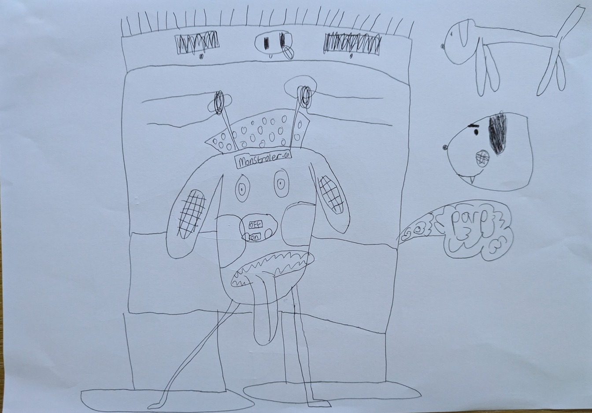 | 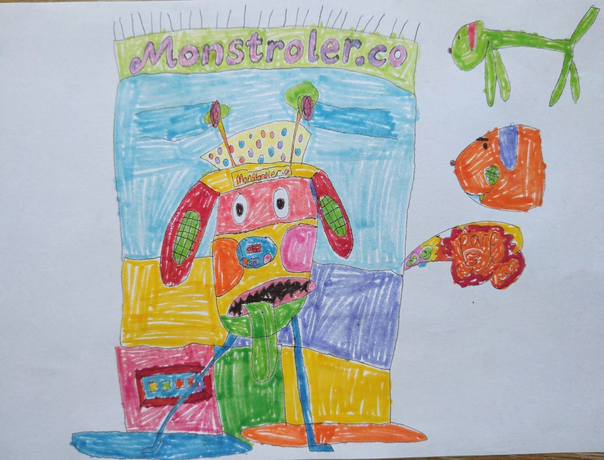 | 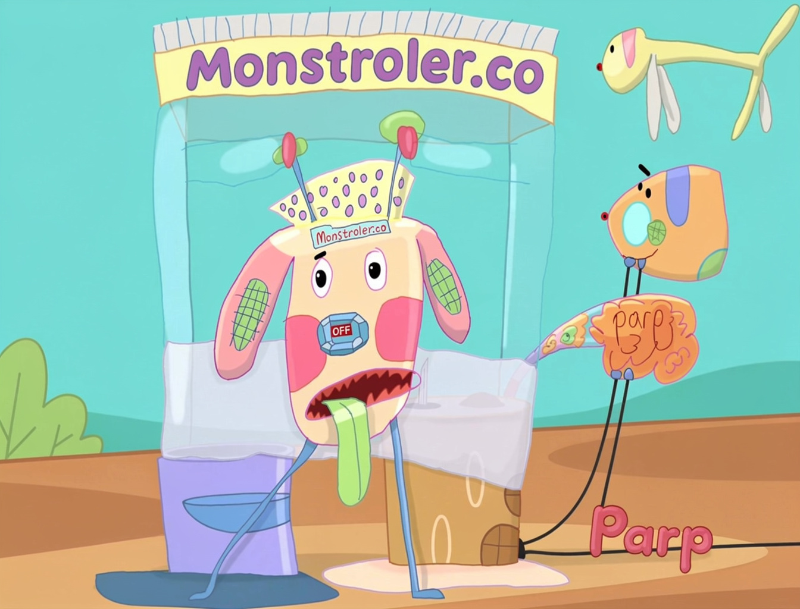 | 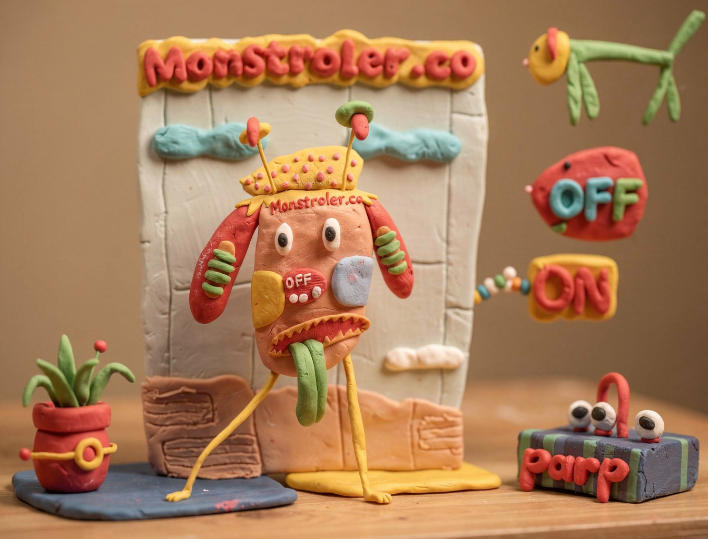 |

## KT the cat

| Original | A: Coloured in | B: Cartoon | C: Clay |
|---|---|---|---|
| 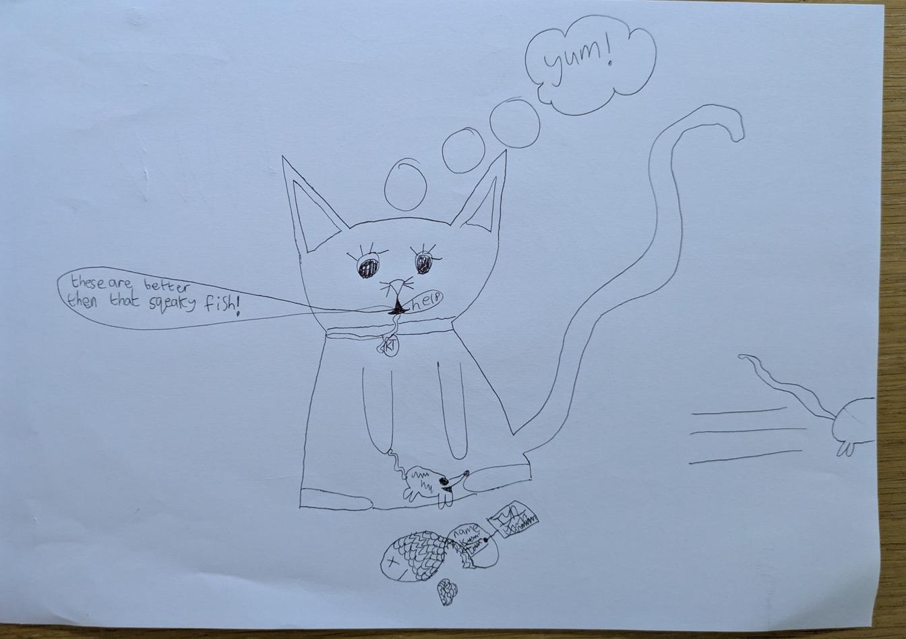 | 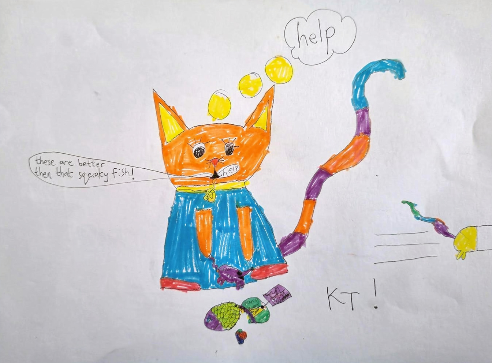 | 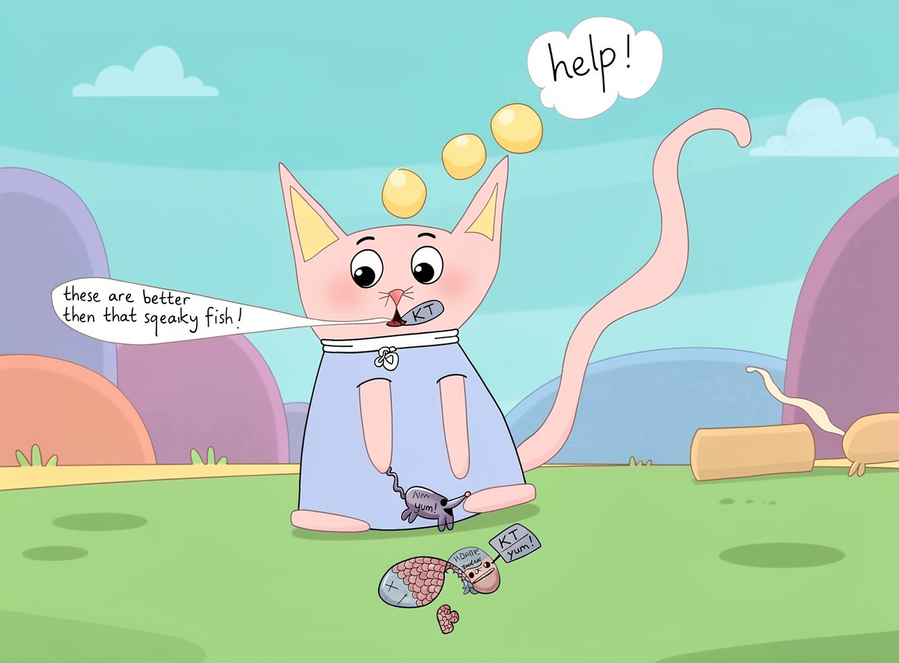 | 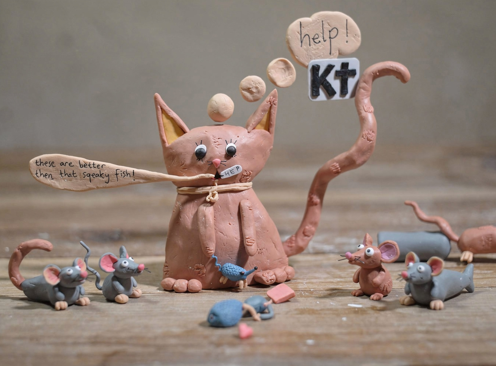 |

## Drift found

- All styles: "Monstroler.co" label copied into a big banner over the bed; the bed became a building.
- KT, all styles: "yum!" bubble became "help!"; "KT" tag moved off the collar.
- KT clay: added 5 extra mice. Monstroler clay: OFF/ON switch pulled off the robot.
- Fix for next round: stop listing the words in the prompt (it made the model re-place them); say "keep all writing where it is".

# Movie gate: shot stills + sample clip

Sample (shot 4, KT mouse escape) frames:

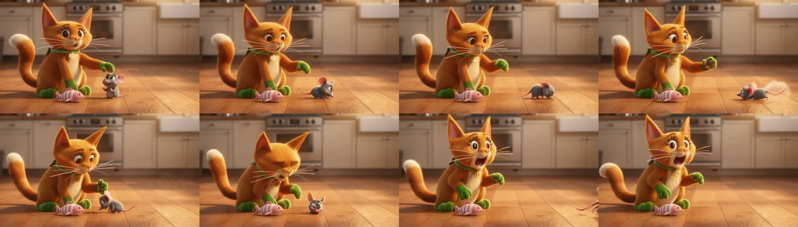

| | |
|---|---|
| 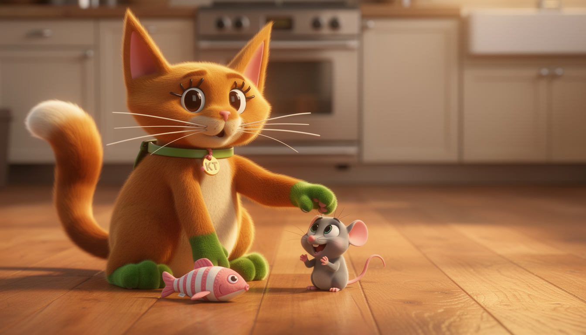 | 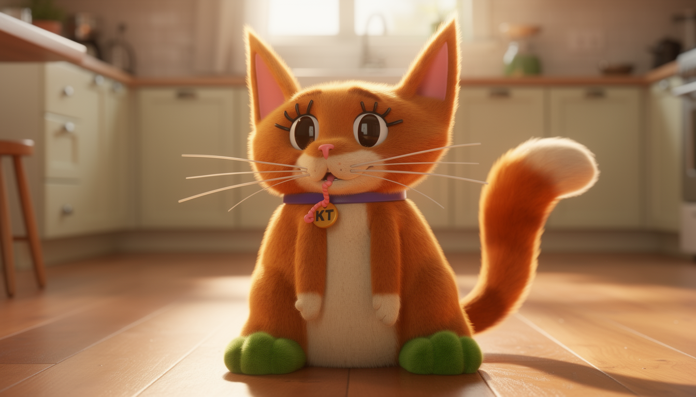 |
| 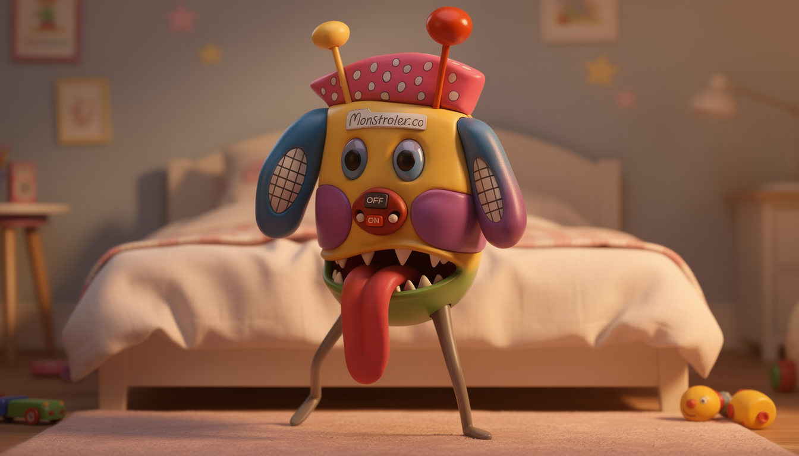 | 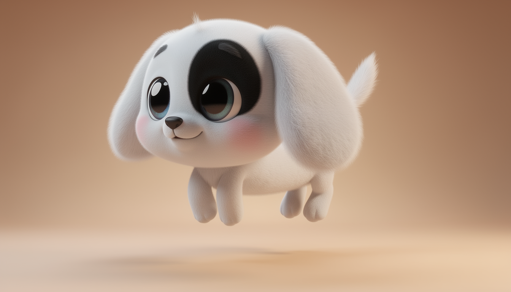 |
| 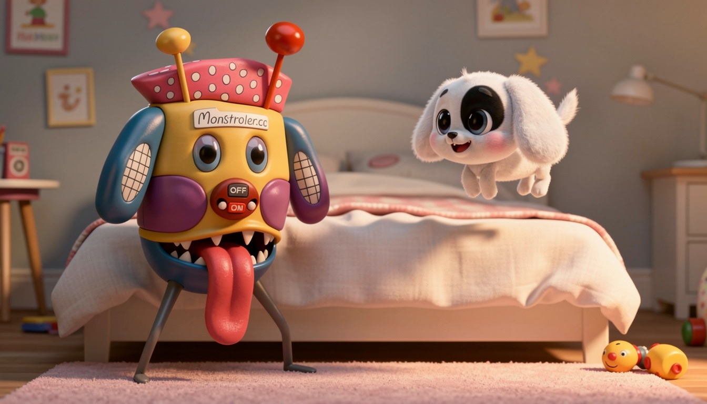 | 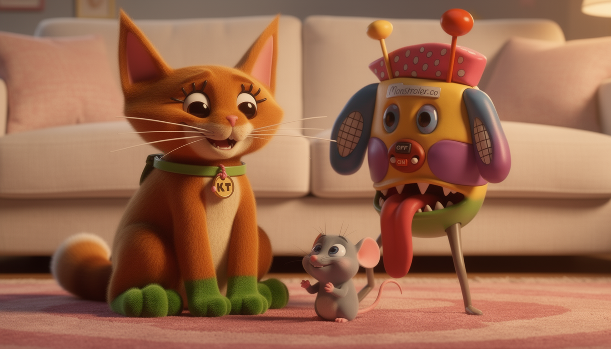 |

Full shot list: [../artifacts/shot_list.md](../artifacts/shot_list.md)

# Final movie: KT & Monstroler (by Elenora)

- Phone copy: [../renders/kt_and_monstroler_phone.mp4](../renders/kt_and_monstroler_phone.mp4)
- Master: [../renders/kt_and_monstroler.mp4](../renders/kt_and_monstroler.mp4)
- Composition: `remotion-composer/public/demo-props/nieces-artwork.json`

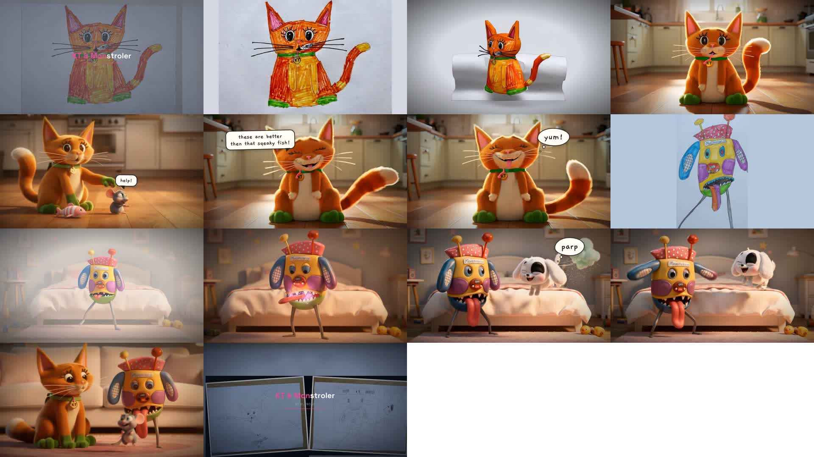
